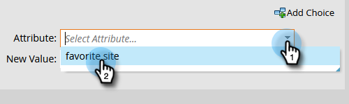

# Modificare i dati membro del programma {#change-program-member-data}

È possibile utilizzare Marketo per aggiornare il valore di un campo utilizzando l&#39;azione di flusso Modifica valore dati.

>[!NOTE]
>
>Puoi anche impedire l’aggiornamento di un campo. Per ulteriori informazioni, consulta Bloccare aggiornamenti a un campo.

1. Nella scheda Flusso di Smart Campaign, richiama il passaggio di flusso **[!UICONTROL Change Program Member Data]** e scegli il programma desiderato.

   

1. Trova e seleziona l’attributo di cui desideri modificare il valore.

   

1. Immettere il valore di attributo desiderato.

   

>[!NOTE]
>
>È inoltre possibile utilizzare i token in [!UICONTROL New Value].

Esegui la campagna avanzata quando è pronta.

>[!TIP]
>
>Se si desidera cancellare i campi invece di aggiornarli, è possibile immettere &quot;NULL&quot; (nessuna virgoletta, tutte maiuscole) come [!UICONTROL New Value].

>[!MORELIKETHIS]
>
>* [Usa token nei passaggi del flusso](/help/marketo/product-docs/core-marketo-concepts/smart-campaigns/flow-actions/use-tokens-in-flow-steps.md){target="_blank"}
>* [Aggiungi dati a un campo](/help/marketo/product-docs/core-marketo-concepts/smart-campaigns/flow-actions/append-data-to-a-field.md){target="_blank"}
