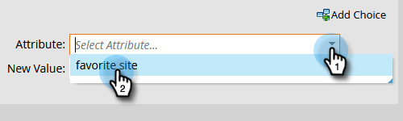

# Modifica dati dei membri del programma {#change-program-member-data}

È possibile utilizzare Marketo per aggiornare il valore di un campo utilizzando l’azione Cambia flusso di valore dei dati.

>[!NOTE]
>
>Puoi anche impedire l’aggiornamento di un campo. Per ulteriori informazioni, consulta la sezione su come aggiornare un campo .

1. Nella scheda Flusso di Smart Campaign, passa il passaggio del flusso **Cambia dati membro del programma** e scegli il programma desiderato.

   

1. Trova e seleziona l’attributo di cui desideri modificare il valore.

   

1. Immettere il valore dell&#39;attributo desiderato.

   

>[!NOTE]
>
>Puoi anche utilizzare i token in Nuovo valore.

Ora esegui la Smart Campaign e hai finito!

>[!TIP]
>
>Se desideri cancellare i campi invece di aggiornarli, puoi immettere &quot;NULL&quot; (senza virgolette, tutte maiuscole) come nuovo valore.

>[!MORELIKETHIS]
>
>* [Utilizzare i token nei passaggi del flusso](/help/marketo/product-docs/core-marketo-concepts/smart-campaigns/flow-actions/use-tokens-in-flow-steps.md)
>* [Aggiungere dati a un campo](/help/marketo/product-docs/core-marketo-concepts/smart-campaigns/flow-actions/append-data-to-a-field.md)

