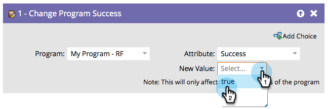

# Modificare il successo del programma {#change-program-success}

Se un gruppo di persone è contrassegnato in modo errato con Program Success (Completato dal programma), puoi utilizzare questo passaggio di flusso per impostare il successo su true o false.

1. Quando trascini in questo passaggio di flusso, il programma verrà automaticamente impostato sul programma che contiene la campagna avanzata che stai modificando.

   >[!NOTE]
   >
   >Saranno interessati solo i membri del programma.

   

1. Selezionare **[!UICONTROL Success]** o **[!UICONTROL Success Date]** come attributo.

   

   >[!NOTE]
   >
   >Se si imposta [!UICONTROL Success Date] su un qualsiasi elemento, l&#39;opzione Success viene impostata automaticamente su true. Se si imposta [!UICONTROL Success] su true, la data di successo viene impostata automaticamente sulla data corrente.

1. Impostare **[!UICONTROL New Value]** su **[!UICONTROL True]** o **[!UICONTROL False]**.

   

   >[!TIP]
   >
   >Puoi utilizzare il passaggio di flusso due volte per impostare sia il flag di successo che la data.

Ora sai come annullare e forzare il successo.
