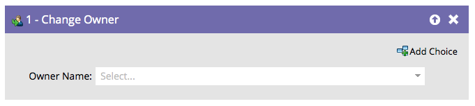
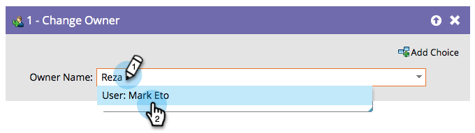

# Modificare proprietario {#change-owner}

Se esistono persone già assegnate a un proprietario, è possibile utilizzare questo passaggio di flusso per riassegnarle a un altro proprietario.

1. È sufficiente scegliere il proprietario o la coda di lead da modificare e andare.

   

   >[!CAUTION]
   >
   >[!DNL Salesforce] non consente l&#39;assegnazione di contatti alle code lead. Per un record corrispondente a un contatto SFDC:
   >
   >* Marketo creerà un lead duplicato **only** quando il contatto verrà sincronizzato con Salesforce. In altre parole, se si utilizza il passaggio di flusso **[Sincronizza persona con SFDC](/help/marketo/product-docs/core-marketo-concepts/smart-campaigns/salesforce-flow-actions/sync-person-to-sfdc.md)** con `AssignTo=<a lead queue>`, Marketo creerà un lead duplicato in Salesforce e lo assegnerà alla coda dei lead.
   >
   >* Se si utilizza il passaggio di flusso **[!UICONTROL Change Owner]** su un contatto, Marketo crea un lead duplicato in Salesforce. Per evitare questo problema, utilizza un filtro nel campo &quot;Tipo SFDC&quot; che limita l’azione ai soli lead.

   >[!NOTE]
   >
   >Se il record non esiste ancora nell&#39;account [!DNL Salesforce], verrà sincronizzato e assegnato all&#39;utente selezionato.
