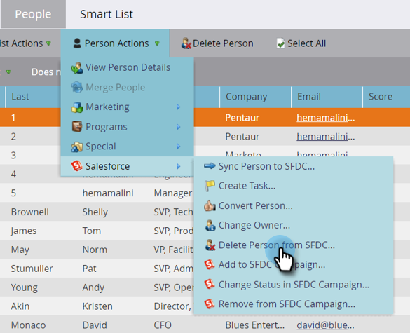

# Eliminare persona da SFDC {#delete-person-from-sfdc}

Se è necessario rimuovere un set specifico di lead da Salesforce, ma lasciarli come persone in Marketo Engage, è possibile utilizzare l&#39;azione di flusso Elimina persona da SFDC.

>[!NOTE]
>
>Disponibile solo se integrato con [!DNL Salesforce].

1. Nel database fare clic sulla persona che si desidera rimuovere da Salesforce. Quindi fare clic su **[!UICONTROL Person Actions]** e selezionare **[!DNL Salesforce]**.

   

1. Seleziona **[!UICONTROL Delete Person from SFDC]**.

   

1. Assicurarsi che l&#39;impostazione **[!UICONTROL Delete in Marketo]** sia **[!UICONTROL false]**, quindi fare clic su **[!UICONTROL Run Now]**.

   

   Dopo l&#39;esecuzione del passaggio di flusso, la persona non sarà più un lead in [!DNL Salesforce] ma rimarrà in Marketo.

   >[!CAUTION]
   >
   >Se imposti **[!UICONTROL Delete in Marketo]** su **[!UICONTROL true]** ed elimini le persone da Marketo e i lead da Salesforce, non ci saranno più. Questa operazione non può essere annullata.
