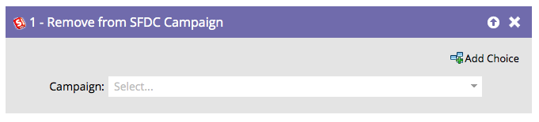

# Rimuovi da SFDC Campaign {#remove-from-sfdc-campaign}

Proprio come puoi [Aggiungere a SFDC Campaign](/help/marketo/product-docs/core-marketo-concepts/smart-campaigns/salesforce-flow-actions/add-to-sfdc-campaign.md){target="_blank"} e [Modificare lo stato in SFDC Campaign](/help/marketo/product-docs/core-marketo-concepts/smart-campaigns/salesforce-flow-actions/change-status-in-sfdc-campaign.md){target="_blank"}, puoi anche rimuovere persone o lead da una campagna Salesforce.

>[!NOTE]
>
>Disponibile solo se integrato con [!DNL Salesforce].

1. Dopo aver trascinato nel passaggio del flusso, individua e seleziona la campagna Salesforce da cui desideri rimuovere la persona o il lead.

   

   >[!TIP]
   >
   >Se la persona o il lead non è un membro della campagna selezionata, verranno ignorati.

Tutto qui. Quando passano persone o lead, questi verranno rimossi dalla campagna [!DNL Salesforce] scelta.
