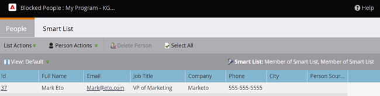

# Visualizzare le persone bloccate in una campagna avanzata {#view-blocked-people-in-a-smart-campaign}

Le persone bloccate nel database di Marketo Engage inserire nell&#39;elenco Bloccati sono contrassegnate come appartenenti a un’e-mail non valida o vuota oppure sono contrassegnate come appartenenti a un gruppo di persone che ha effettuato l’iscrizione o che ha annullato l’iscrizione, che hanno sospeso l’attività di marketing e/o un messaggio e-mail non valido o vuoto.

1. Nella tua Smart Campaign, fai clic su **[!UICONTROL Schedule]**. In **[!UICONTROL Smart List Status]** fare clic sul secondo collegamento.

   

   >[!NOTE]
   >
   >Anche le persone che hanno raggiunto il limite di comunicazione possono essere bloccate dalla ricezione di e-mail. Scopri come [modificare i limiti di comunicazione](/help/marketo/product-docs/administration/email-setup/enable-communication-limits.md){target="_blank"} nella sezione Amministratore.

   La scheda **[!UICONTROL Blocked Leads]** mostra gli utenti che potrebbero non ricevere messaggi.

   

   >[!NOTE]
   >
   >Le e-mail operative verranno inviate a persone contrassegnate come non abbonate e il marketing verrà sospeso.

   >[!MORELIKETHIS]
   >
   >* [Modifica regole di qualifica](/help/marketo/product-docs/core-marketo-concepts/smart-campaigns/using-smart-campaigns/edit-qualification-rules-in-a-smart-campaign.md){target="_blank"}
   >* [Abilita limiti di comunicazione](/help/marketo/product-docs/administration/email-setup/enable-communication-limits.md){target="_blank"}
   >* [Visualizza membri di Smart Campaign](/help/marketo/product-docs/core-marketo-concepts/smart-campaigns/smart-campaign-data/view-smart-campaign-members.md){target="_blank"}
   >* [Visualizza persone qualificate in una campagna avanzata](/help/marketo/product-docs/core-marketo-concepts/smart-campaigns/smart-campaign-data/view-qualified-people-in-a-smart-campaign.md){target="_blank"}
