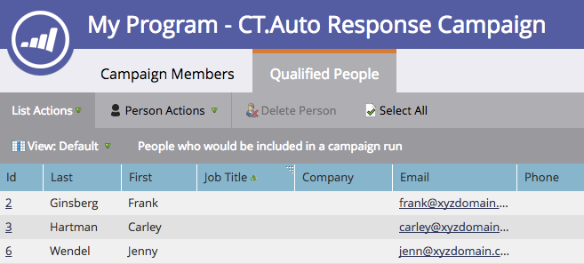

# Visualizzare le persone qualificate in una campagna avanzata {#view-qualified-people-in-a-smart-campaign}

Visualizza le persone idonee per l’esecuzione di una campagna avanzata durante il flusso.

1. Nella campagna intelligente, fai clic su Pianifica. In Stato elenco avanzato, fai clic sul primo collegamento.

>[!NOTE]
>
>Le campagne avanzate di attivazione non visualizzano le persone qualificate, in quanto vengono eseguite in base a eventi live.

1. La scheda **Persone qualificate** elenca le persone idonee ad attraversare il flusso durante l&#39;esecuzione della campagna.

   

   >[!CAUTION]
   >
   >L&#39;elenco Persone qualificate non tiene conto delle persone bloccate o che hanno raggiunto i limiti di comunicazione.

   >[!NOTE]
   >
   >Il numero di persone qualificate dipende anche dalle regole di qualificazione delle campagne intelligenti. Scopri come [modificare le regole di qualificazione](/help/marketo/product-docs/core-marketo-concepts/smart-campaigns/using-smart-campaigns/edit-qualification-rules-in-a-smart-campaign.md).

Dolce! È possibile utilizzare questo elenco per verificare quali persone potrebbero attraversare il flusso prima di eseguire una campagna intelligente.

>[!MORELIKETHIS]
>
>* [Visualizzare i membri di Smart Campaign](/help/marketo/product-docs/core-marketo-concepts/smart-campaigns/smart-campaign-data/view-smart-campaign-members.md)
>* [Visualizzare le persone bloccate in una campagna avanzata](/help/marketo/product-docs/core-marketo-concepts/smart-campaigns/smart-campaign-data/view-blocked-people-in-a-smart-campaign.md)
>* [Aggiungere un passaggio di flusso a una campagna avanzata](/help/marketo/product-docs/core-marketo-concepts/smart-campaigns/flow-actions/add-a-flow-step-to-a-smart-campaign.md)

