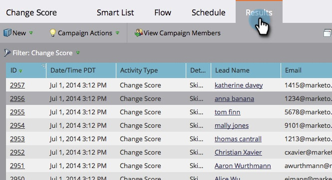

# Visualizzare i risultati delle campagne intelligenti {#view-smart-campaign-results}

Vuoi vedere un raggruppamento di tutto ciò che è successo in una campagna intelligente? È facile, ecco come.

1. Nella campagna intelligente, fai clic su **Risultati**.

   >[!TIP]
   >
   >Per visualizzare l’elenco delle persone elaborate dalla campagna intelligente, fai clic su [Visualizza membri della campagna](/help/marketo/product-docs/core-marketo-concepts/smart-campaigns/smart-campaign-data/view-smart-campaign-members.md).

   

   >[!TIP]
   >
   >Puoi anche filtrare i risultati in base al tipo di attività. Scopri come [filtrare i risultati delle campagne intelligenti](/help/marketo/product-docs/core-marketo-concepts/smart-campaigns/smart-campaign-data/filter-smart-campaign-results.md).

1. Fai clic su **ID** per visualizzare più dettagli su questa particolare attività.

   

   >[!TIP]
   >
   >Visualizzare i dettagli della persona facendo clic sul nome della persona.

   Approfondisci i risultati per vedere cosa ha fatto la tua campagna, o semplicemente [esportare i risultati delle campagne intelligenti in Excel](/help/marketo/product-docs/core-marketo-concepts/smart-campaigns/smart-campaign-data/export-smart-campaign-results-to-excel.md).

   >[!MORELIKETHIS]
   >
   >[Filtrare i risultati di una campagna avanzata](/help/marketo/product-docs/core-marketo-concepts/smart-campaigns/smart-campaign-data/filter-smart-campaign-results.md)
