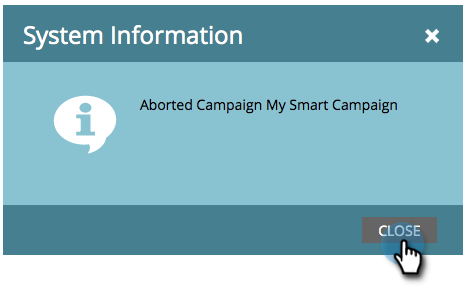

# Interrompere una campagna avanzata {#abort-a-smart-campaign}

>[!CAUTION]
>
>Solo per uso di emergenza

A volte si lancia una campagna intelligente e immediatamente si rende conto che è stato un errore. Ecco come tirare il freno di emergenza e fermare la campagna intelligente a metà corsa.

1. In **Attività di marketing**, seleziona la campagna avanzata e vai alla scheda **Pianificazione** .

   

1. Fai clic sul menu a discesa **Azioni campagna** . Seleziona **Interrompi campagna**.

   

1. Fai clic su **Interrompi** per confermare.

   

   >[!NOTE]
   >
   >L’interruzione non annulla i passaggi già completati, ma ne impedisce l’esecuzione. (Esempio: Le e-mail non possono essere annullate.)

   

   >[!NOTE]
   >
   >Osserva la scheda **Risultati** della campagna intelligente per vedere quali azioni sono state eseguite prima dell’interruzione. Troverai anche una [notifica](/help/marketo/product-docs/core-marketo-concepts/miscellaneous/understanding-notifications.md) con ulteriori dettagli.

   >[!TIP]
   >
   >Vuoi rimuovere una persona dal flusso in una campagna trigger? Estrai [Rimuovi da Flusso](/help/marketo/product-docs/core-marketo-concepts/smart-campaigns/flow-actions/remove-from-flow.md).

Controlla sempre il tuo lavoro, ma questo freno d&#39;emergenza potrebbe essere utile in futuro.
