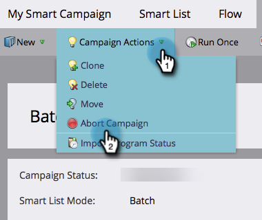
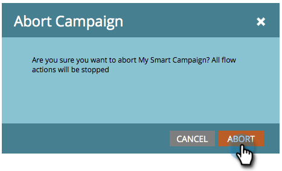

# Interrompere una campagna avanzata {#abort-a-smart-campaign}

>[!CAUTION]
>
>Solo Per Uso Di Emergenza

A volte avvii una campagna avanzata e capisci subito che si è trattato di un errore. Ecco come tirare il freno di emergenza e fermare la campagna Smart a metà corsa.

1. Scegli la campagna avanzata desiderata e fai clic su **Pianificazione** scheda.

   

1. Fai clic su **Azioni campagna** a discesa. Seleziona **Interrompi campagna**.

   

1. Clic **Interrompi** per confermare.

   

   >[!NOTE]
   >
   >L’interruzione non annulla i passaggi già completati, ma solo interrompe l’esecuzione di altre operazioni (ad esempio: non è possibile annullare la consegna delle e-mail).

   

   >[!NOTE]
   >
   >Dai un&#39;occhiata al **Risultati** della Smart Campaign per visualizzare quali azioni sono state eseguite prima dell’interruzione. Troverai anche un  [notifica](/help/marketo/product-docs/core-marketo-concepts/miscellaneous/understanding-notifications.md) con ulteriori dettagli.

   >[!TIP]
   >
   >Desideri rimuovere una persona dal flusso in una campagna trigger? Estrai [Rimuovi dal flusso](/help/marketo/product-docs/core-marketo-concepts/smart-campaigns/flow-actions/remove-from-flow.md).

Ricontrollare sempre il lavoro, ma questo freno di emergenza potrebbe tornare utile in futuro.
