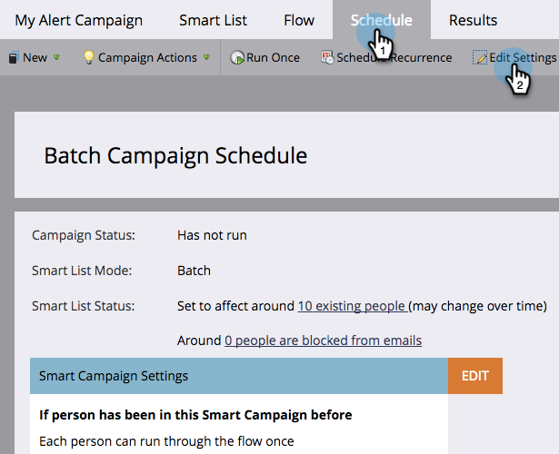

# Applicare limiti di comunicazione a campagne avanzate {#apply-communication-limits-to-smart-campaign}

>[!PREREQUISITES]
>
>[Abilita limiti di comunicazione](/help/marketo/product-docs/administration/email-setup/enable-communication-limits.md){target="_blank"}

Non è una buona idea mandare email a qualcuno più volte al giorno, o troppe volte in una settimana, giusto? Fortunatamente, Marketo Engage ha dei limiti di comunicazione per aiutarti.

>[!NOTE]
>
>Quando una persona supera i limiti di comunicazione impostati, Marketo blocca le e-mail non operative (le e-mail operative vengono sempre inviate).

1. In Smart Campaign, fai clic sulla scheda **[!UICONTROL Schedule]** e quindi su **[!UICONTROL Edit Settings]**.

   

1. Selezionare la casella di controllo **[!UICONTROL Block non-operational emails]** e quindi fare clic su **[!UICONTROL Save]**.

   

>[!NOTE]
>
>Il limite si riferisce al numero di persone qualificate su cui può incidere una campagna intelligente.

>[!TIP]
>
>Per impostare questa impostazione come predefinita, modifica i [limiti di comunicazione](/help/marketo/product-docs/administration/email-setup/enable-communication-limits.md){target="_blank"} nella sezione Amministratore.

Ora puoi stare certo che non invii accidentalmente troppe e-mail al pubblico.
