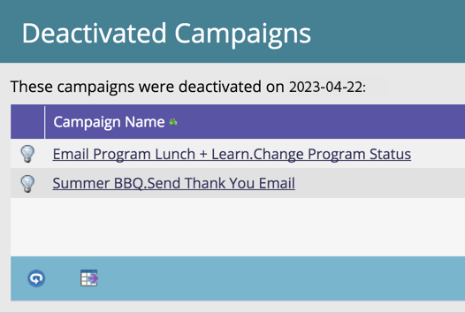

# Pulizia automatica campagna trigger {#automatic-trigger-campaign-cleanup}

Marketo dispone di un servizio gratuito per disattivare le campagne intelligenti attivate che non ricevono più attività. In questo modo è possibile migliorare le prestazioni complessive del sistema e risparmiare tempo.

## Cosa succede? {#what-happens}

Una volta al trimestre, Marketo troverà campagne intelligenti che sono rimaste inattive (senza persone) per 6 mesi o più e le disattiverà.

## Mi avviserà prima? {#will-you-notify-me-first}

Certo! Una volta al trimestre, riceverai una notifica con una settimana di anticipo, indicando ogni campagna che prevediamo di disattivare.

1. Fai clic su **Notifiche** icona.

   

1. Clic **Pianificazione pulizia campagna attivazione inattività**. Quindi fai clic su **Queste campagne con trigger di inattività verranno disattivate** collegamento.

   

   Viene visualizzato un elenco delle campagne intelligenti pianificate per la disattivazione.

   

## Quali campagne verranno disattivate? {#which-campaigns-will-be-deactivated}

Disattiveremo solo le campagne trigger che sono state attive per oltre 6 mesi ma che hanno avuto 0 persone idonee in quel periodo di tempo.

## Aspetta! Non questa campagna! {#wait-not-this-campaign}

Non preoccuparti: l’orologio di qualsiasi campagna intelligente può essere reimpostato da:

* Persona qualificata per la campagna.
* Disattivazione e riattivazione manuale della campagna.

In entrambi i casi verrà reimpostato il contatore di 6 mesi.

## Vuoi farmi sapere quali campagne sono state disattivate? {#will-you-let-me-know-which-campaigns-were-deactivated}

Assolutamente - una settimana dopo la notifica originale, disattiveremo le campagne elencate (meno quelle che hanno qualificato almeno una persona o che sono state disattivate/riattivate) e invieremo una notifica di conferma.

1. Seleziona la **Pianificazione pulizia campagna attivazione inattività** notifica. Fai clic su **Queste campagne con trigger inattivi** collegamento.

   

1. Viene visualizzato un elenco delle campagne disattivate.

   
