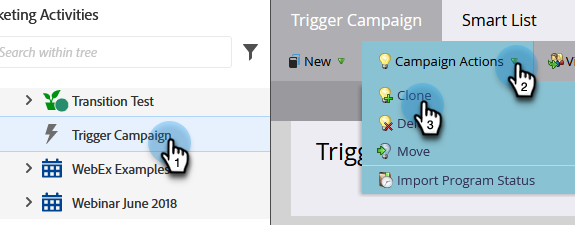

# Azioni campagna: clonare una campagna avanzata {#campaign-actions-clone-a-smart-campaign}

Le campagne di clonazione consentono di risparmiare tempo. Non è necessario creare tutto da zero: la clonazione crea una campagna identica con gli stessi filtri di elenchi avanzati e le stesse fasi di flusso.

1. Seleziona la campagna da clonare. Nel menu a discesa **[!UICONTROL Campaign Actions]**, selezionare **[!UICONTROL Clone]**.

   

1. Scegliere l&#39;opzione **[!UICONTROL Clone To]** appropriata. In questo esempio, scegliamo **[!UICONTROL Programs]**.

   

1. Scegli un **[!UICONTROL Program]**. Immettere **[!UICONTROL Campaign Name]** e fare clic su **[!UICONTROL Clone]**.

   

E fatto!
