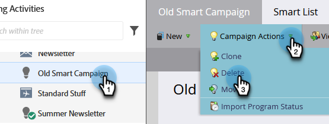

# Azioni campagna: Eliminare una campagna avanzata {#campaign-actions-delete-a-smart-campaign}

Se hai una vecchia campagna intelligente di cui non hai più bisogno, puoi cancellarla. Ecco come.

>[!CAUTION]
>
>Assicurati prima di eliminare. Una volta eliminata una campagna intelligente, non può essere ripristinata.

1. Vai a **Attività di marketing** area.

   

1. Passa alla campagna avanzata inattiva. In **Campaign** **Azioni** a discesa, seleziona **Elimina**.

   

   >[!TIP]
   >
   >Per annullare l&#39;elaborazione di una campagna intelligente attiva senza eliminarla completamente, scopri come [interrompere una campagna intelligente](/help/marketo/product-docs/core-marketo-concepts/smart-campaigns/using-smart-campaigns/abort-a-smart-campaign.md).

1. Fai clic su **Elimina** per confermare.

   

   >[!CAUTION]
   >
   >Do **NOT** elimina una campagna avanzata attiva con le persone nei passaggi del flusso. È probabile che la campagna venga comunque eseguita.
