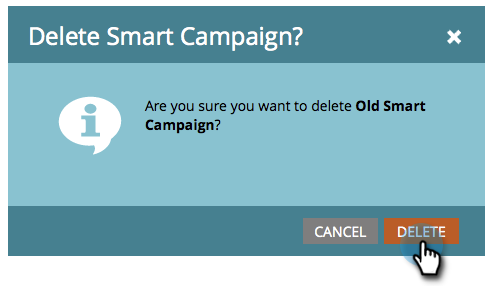

# Azioni campagna: eliminare una campagna avanzata {#campaign-actions-delete-a-smart-campaign}

Se disponi di una vecchia campagna avanzata di cui non hai più bisogno, puoi eliminarla.

>[!CAUTION]
>
>Assicurati di aver eliminato. Una volta eliminata, una campagna avanzata non può essere ripristinata.

1. Passa alla schermata **[!UICONTROL Marketing Activities]**.

   

1. Passa a Smart Campaign inattiva. Nel menu a discesa **[!UICONTROL Campaign Actions]**, selezionare **[!UICONTROL Delete]**.

   

   >[!TIP]
   >
   >Per annullare l&#39;elaborazione di una campagna Smart attiva senza eliminarla del tutto, scopri come [interrompere una campagna Smart](/help/marketo/product-docs/core-marketo-concepts/smart-campaigns/using-smart-campaigns/abort-a-smart-campaign.md).

1. Fai clic su **[!UICONTROL Delete]** per confermare.

   

   >[!CAUTION]
   >
   >NON eliminare una campagna avanzata attiva con persone nei passaggi del flusso. La campagna sarà probabilmente ancora in esecuzione.
