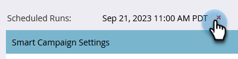

# Annullare un’esecuzione di una campagna batch pianificata {#cancel-a-scheduled-batch-campaign-run}

Se hai pianificato un&#39;esecuzione per una delle campagne batch e desideri annullarla, ecco come.

1. Seleziona la campagna e vai alla **Pianificazione** scheda .

   

1. Trova l&#39;esecuzione pianificata che desideri annullare e fai clic sul pulsante **x** accanto.

   

1. Conferma l’annullamento facendo clic su **OK**.

   

>[!NOTE]
>
>Questa operazione non sarà utile se l&#39;esecuzione è già iniziata. Utilizzalo quando decidi che un&#39;esecuzione futura deve essere annullata.
