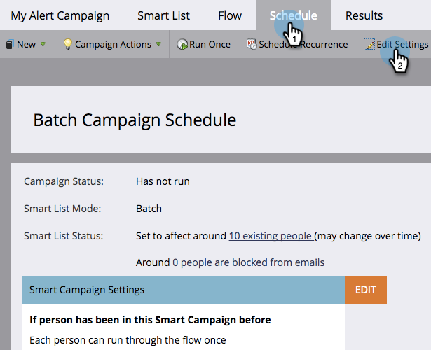

# Modificare le regole di qualificazione in una campagna avanzata {#edit-qualification-rules-in-a-smart-campaign}

Le regole di qualifica controllano quante volte un utente può eseguire il flusso in una campagna avanzata. Per impostazione predefinita, anche se un utente attiva più volte una campagna avanzata, il messaggio viene inviato tramite il flusso solo una volta. Per modificare queste impostazioni, procedere come segue.

1. In Smart Campaign, fai clic sulla scheda **[!UICONTROL Schedule]** e quindi su **[!UICONTROL Edit Settings]**.

   

   >[!TIP]
   >
   >Puoi anche fare clic su **[!UICONTROL Edit]** a destra di &quot;Impostazioni Smart Campaign&quot;.

1. Scegli la frequenza con cui eseguire le persone tramite il flusso di Smart Campaign: **[!UICONTROL only once]**, **[!UICONTROL every time]** o **una volta ogni # giorni**/**settimane**/**mesi**.

   

   >[!NOTE]
   >
   >Quando imposti una regola per una volta al giorno, Marketo la converte in ore. Ad esempio, se imposti la regola per una volta al giorno e una persona è idonea alle 22:00 di domenica sera, non può qualificarsi di nuovo fino alle 22:00 di lunedì sera. Questa logica si applica anche quando si utilizzano settimane o mesi. Un mese viene sempre conteggiato come 30 giorni.

   >[!NOTE]
   >
   >Per impostazione predefinita, i limiti di comunicazione non vengono applicati alle campagne intelligenti. Scopri come [applicare limiti di comunicazione a una campagna avanzata](/help/marketo/product-docs/core-marketo-concepts/smart-campaigns/using-smart-campaigns/apply-communication-limits-to-smart-campaign.md){target="_blank"}.

   >[!NOTE]
   >
   >[Applica limiti di comunicazione alle campagne intelligenti](/help/marketo/product-docs/core-marketo-concepts/smart-campaigns/using-smart-campaigns/apply-communication-limits-to-smart-campaign.md){target="_blank"}

Missione compiuta! Ora sai come controllare le regole di qualificazione in una campagna intelligente.
