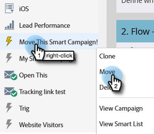

# Spostare una campagna avanzata {#move-a-smart-campaign}

Per spostare una campagna intelligente tra diversi programmi o cartelle, trascinala o sposta nella struttura. Le regole della campagna intelligente non verranno modificate, ma verranno semplicemente nidificate in un punto diverso.

1. Vai a **Attività di marketing**.

   

1. Individua la campagna avanzata da spostare, fai clic con il pulsante destro del mouse su di essa e seleziona **Sposta**.

   

1. Selezionare **To** (destinazione), **Program** e **Folder** opzionale. Selezionare **Sposta**.

   

   >[!NOTE]
   >
   >In questo esempio stiamo spostando Smart Campaign in un altro programma, ma puoi anche spostarlo in una cartella della campagna.

Ben fatto! La campagna avanzata è stata spostata.

