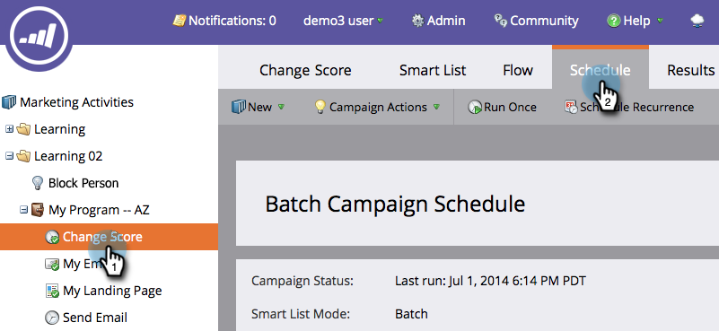

# Escludere le limitazioni di persona in una campagna avanzata {#override-person-restrictions-in-a-smart-campaign}

Marketo consente di impostare il numero massimo di persone idonee per una campagna intelligente; questo consente di evitare di inviare accidentalmente un&#39;e-mail all&#39;intero database. Se desideri _sovrascrivere_ questo limite, ecco come.

>[!PREREQUISITES]
>
>Assicurati di [abilitare le restrizioni alle persone per le campagne intelligenti](/help/marketo/product-docs/administration/email-setup/enable-person-restrictions-for-smart-campaigns.md) nell&#39;amministratore di Marketo.

1. In Attività di marketing, accedi alla tua campagna avanzata e fai clic su **Pianifica**.

   

1. In Impostazioni campagna avanzata, fai clic su **Modifica**.

   

   >[!NOTE]
   >
   >Il limite predefinito è quello impostato in Amministratore.

1. Inserisci un nuovo limite e fai clic su **Salva.**

   

   La campagna intelligente non verrà eseguita se il numero di persone idonee supera il limite impostato.

   >[!CAUTION]
   >
   >Presta attenzione con questa funzione in modo da non includere accidentalmente troppe persone.
