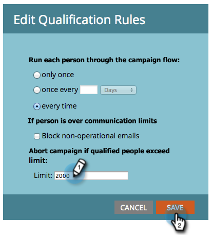

# Sovrascrivere le restrizioni relative alla persona in una campagna intelligente {#override-person-restrictions-in-a-smart-campaign}

Marketo consente di impostare il numero massimo di persone che possono qualificarsi per una campagna intelligente; in questo modo è possibile evitare di inviare accidentalmente e-mail all’intero database. Se vuoi _sostituire_ questo limite, ecco come.

>[!PREREQUISITES]
>
>Assicurati di [abilita restrizioni persona per campagne intelligenti](/help/marketo/product-docs/administration/email-setup/enable-person-restrictions-for-smart-campaigns.md) in Amministrazione Marketo.

1. In Attività di marketing, vai alla tua campagna intelligente e fai clic su **Pianificazione**.

   

1. In Impostazioni campagna avanzata, fai clic su **Modifica**.

   

   >[!NOTE]
   >
   >Il limite predefinito è quello impostato in Amministratore.

1. Inserisci un nuovo limite e fai clic su **Salva.**

   

   La campagna intelligente non verrà eseguita se il numero di persone idonee supera il limite impostato.

   >[!CAUTION]
   >
   >Presta attenzione con questa funzione in modo da non includere accidentalmente troppe persone.
