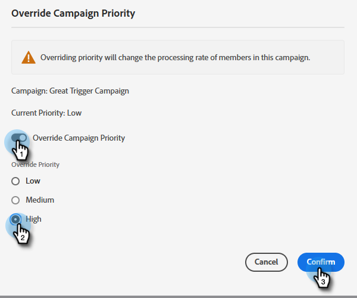
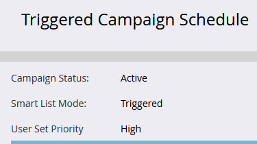

# Sovrascrittura priorità per campagne trigger {#priority-override-for-trigger-campaigns}

Gli amministratori possono ignorare la determinata priorità di Marketo per attivare campagne per impostare priorità che si allineano meglio agli obiettivi aziendali.

>[!NOTE]
>
>Questa funzione è disponibile solo per le campagne trigger e per gli utenti a cui è stato concesso il [Autorizzazione &quot;Modifica priorità campagna trigger&quot;](#grant-priority-override-access).

>[!CAUTION]
>
>Si consiglia vivamente di utilizzare questa funzione su un set limitato di campagne aziendali critiche (25 è il massimo consigliato). L’utilizzo generico della funzione su un set di grandi dimensioni può influire negativamente sull’esecuzione complessiva della campagna.

## Concedi accesso di sostituzione priorità {#grant-priority-override-access}

>[!NOTE]
>
>Solo gli amministratori o gli utenti con responsabilità di amministratore devono avere accesso con priorità alla sostituzione della campagna.

1. In [!UICONTROL Amministratore] , fare clic su **[!UICONTROL Utenti e ruoli]**.

   

1. Fai clic su **[!UICONTROL Ruoli]** , selezionare l&#39;utente a cui si desidera concedere l&#39;accesso, quindi fare clic su **[!UICONTROL Modifica Ruolo]**.

   

1. Sotto [!UICONTROL Accedere alle attività di marketing], seleziona **[!UICONTROL Modifica Priorità Campagna Attivatore]**. Clic **[!UICONTROL Salva]**.

   

## Sovrascrivi priorità {#override-priority}

1. Individua la campagna trigger. Fai clic con il pulsante destro del mouse e seleziona (Confronta periodi di tempo) **[!UICONTROL Ignora priorità campagna]**.

   

1. Fai clic su **[!UICONTROL Ignora priorità campagna]** cursore per l&#39;attivazione. Scegli un nuovo livello di priorità e fai clic su **[!UICONTROL Conferma]**.

   

   Il nuovo livello di priorità viene visualizzato nella scheda Pianificazione.

   

>[!NOTE]
>
>* Puoi visualizzare la priorità predefinita della campagna in [!UICONTROL Coda campagna] in [!UICONTROL Attività di marketing]. Per aumentare il tasso di esecuzione, si consiglia di impostare la priorità della campagna su un livello più alto del valore predefinito.
>* La priorità impostata dall&#39;utente si applica solo alle nuove persone che si qualificano per la campagna; le persone già in coda non saranno interessate.
>* Le sostituzioni di priorità vengono acquisite in [Audit Trail](/help/marketo/product-docs/administration/audit-trail/audit-trail-overview.md).
