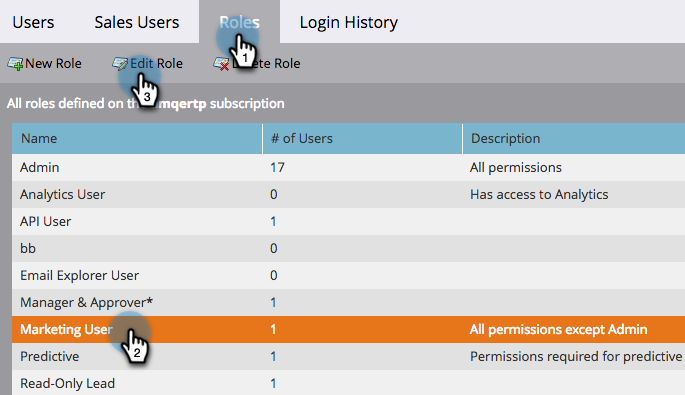

# Sovrascrittura priorità per campagne trigger {#priority-override-for-trigger-campaigns}

Gli amministratori possono ignorare la priorità determinata dal Marketo Engage per attivare le campagne per impostare priorità che si allineano meglio agli obiettivi aziendali.

>[!NOTE]
>
>Questa funzionalità è disponibile solo per le campagne Trigger e per gli utenti che dispongono dell&#39;autorizzazione [&quot;Modifica priorità campagna Trigger&quot;](#grant-priority-override-access).

>[!CAUTION]
>
>Si consiglia vivamente di utilizzare questa funzione su un set limitato di campagne aziendali critiche (25 è il massimo consigliato). L’utilizzo generico della funzione su un set di grandi dimensioni può influire negativamente sull’esecuzione complessiva della campagna.

## Concedi accesso di sostituzione priorità {#grant-priority-override-access}

>[!NOTE]
>
>Solo gli amministratori o gli utenti con responsabilità di amministratore devono avere accesso con priorità alla sostituzione della campagna.

1. Nell&#39;area [!UICONTROL Amministratore], fare clic su **[!UICONTROL Utenti e ruoli]**.

   

1. Fai clic sulla scheda **[!UICONTROL Ruoli]**, seleziona l&#39;utente a cui desideri concedere l&#39;accesso, quindi fai clic su **[!UICONTROL Modifica ruolo]**.

   

1. In [!UICONTROL Accedi alle attività di marketing], seleziona **[!UICONTROL Modifica priorità campagna trigger]**. Fai clic su **[!UICONTROL Salva]**.

   

## Sovrascrivi priorità {#override-priority}

1. Individua la campagna Trigger. Fai clic con il pulsante destro del mouse su di esso e seleziona **[!UICONTROL Ignora priorità campagna]**.

   

1. Fai clic sul cursore **[!UICONTROL Ignora priorità campagna]** per abilitare. Scegli un nuovo livello di priorità e fai clic su **[!UICONTROL Conferma]**.

   

   Il nuovo livello di priorità viene visualizzato nella scheda Pianificazione.

   

>[!NOTE]
>
>* Puoi visualizzare la priorità predefinita della tua campagna nella [!UICONTROL Coda campagna] in [!UICONTROL Attività di marketing]. Per aumentare il tasso di esecuzione, si consiglia di impostare la priorità della campagna su un livello più alto del valore predefinito.
>* La priorità impostata dall&#39;utente si applica solo alle nuove persone che si qualificano per la campagna; le persone già in coda non saranno interessate.
>* Le sostituzioni di priorità vengono acquisite in [Audit Trail](/help/marketo/product-docs/administration/audit-trail/audit-trail-overview.md){target="_blank"}.
