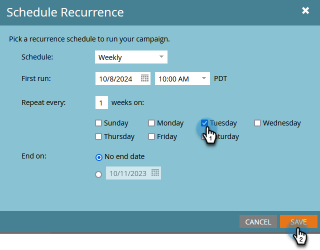
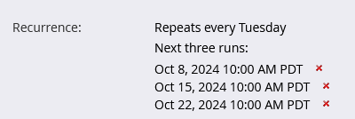

# Pianificare una campagna batch ricorrente {#schedule-a-recurring-batch-campaign}

La ricorrenza consente di eseguire una campagna in batch secondo una pianificazione regolare. Ad esempio: una volta alla settimana, martedì alle ore 00:00.:00

1. Selezionare Smart Campaign, passare alla scheda **[!UICONTROL Schedule]** e fare clic su **[!UICONTROL Schedule Recurrence]**.

   

1. Fai clic sul menu a discesa **[!UICONTROL Schedule]** e seleziona **[!UICONTROL Weekly]**.

   

1. Fai clic sull’icona del calendario e seleziona il giorno desiderato per la prima esecuzione.

   

1. Seleziona l’ora in cui deve essere eseguito.

   

1. Lascia &quot;[!UICONTROL Repeat every]&quot; come 1, seleziona Martedì e fai clic su **[!UICONTROL Save]**.

   

   >[!NOTE]
   >
   >Per una durata di esecuzione specifica, è possibile fare clic sull&#39;icona del calendario accanto a **[!UICONTROL End on]** e scegliere la data di fine.

Le ricorrenze pianificate vengono visualizzate nella parte inferiore della scheda Pianificazione.

>[!NOTE]
>
>Nella scheda Pianificazione vengono visualizzate le tre occorrenze successive come riferimento. Se si fa clic su **X** rosso, l&#39;esecuzione specifica verrà annullata.
