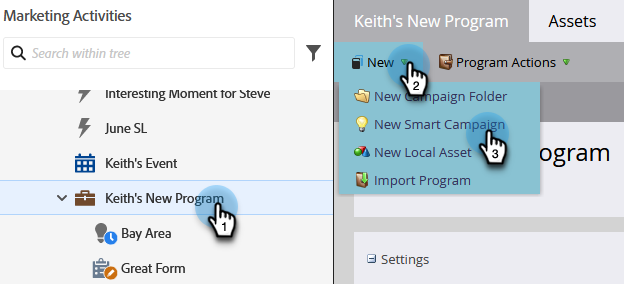

# Impostare una campagna avanzata trigger per le vendite tramite “È richiesta la campagna” {#setting-up-a-trigger-smart-campaign-for-sales-using-campaign-is-requested}

Una delle caratteristiche più interessanti di Marketo è la possibilità di coinvolgere il personale di vendita nelle attività di marketing. Sono in prima linea, interagiscono con le persone. Gli agenti di vendita devono essere in grado di indirizzare il marketing nella giusta direzione.

>[!NOTE]
>
>Esempi di campagne intelligenti da richiedere:
>
>1. **Alimentazione a lungo termine** - se quest&#39;anno non hanno un budget e vuoi solo restare nel radar
>1. **Ciclo di vendita attivo** - quando il venditore non desidera inviare messaggi alla persona, ad eccezione dei propri. (utilizza il flag marketing sospeso per annullare temporaneamente l’abbonamento)
>
>Sii creativo. Cosa vorrebbe automatizzare il venditore? Chiedetelo a loro e collegatelo!

1. Creare una campagna avanzata.

   

1. Trova e trascina il trigger **[!UICONTROL Campaign is Requested]** nell&#39;area di lavoro.

   

1. Le scelte di origine indicano il tipo di richiesta che verrà rispettata. Per la funzionalità Salesforce, assicurarsi di scegliere **[!UICONTROL Sales Insight]**.

   >[!TIP]
   >
   >Gli operatori di origine sono per la sicurezza. Puoi limitare la campagna alle richieste effettuate solo da origini specifiche, come altre campagne avanzate o sviluppatori. Scegliere **[!UICONTROL Is Any]** nella prima casella se si desidera consentire le richieste da tutte le origini.
   >
   >_Ricorda_, scegliendo Vendite Insight, verrà magicamente visualizzato nella casella per le vendite. Non esagerare. Troppi verranno ignorati da loro.

   

È un ottimo modo per estendere la tua portata di marketing ad altri reparti. Imposta tutti i tipi di campagne per l’automazione.

>[!TIP]
>
>Non dimenticare di dare un nome chiaro alle campagne avanzate. In Sales Insight verranno visualizzati esattamente come li si chiama.
