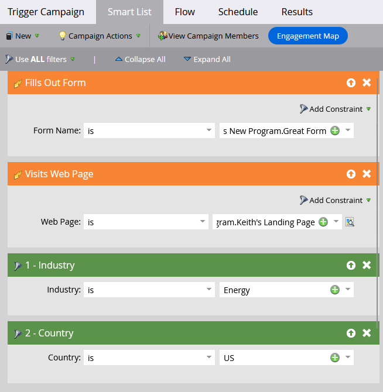

# Utilizzo della logica standard per le regole di elenchi avanzati {#using-standard-smart-list-rule-logic}

Potresti aver notato l’opzione &quot;Usa filtri&quot; durante la creazione degli elenchi avanzati delle campagne. Questa impostazione consente di decidere se i filtri devono essere valutati con un operatore AND o OR.


>[!NOTE]
>
>La modifica della logica della regola dell&#39;elenco smart si applica solo ai filtri, _not_ trigger.

Gli attivatori vengono sempre valutati come OR anche se l’impostazione precedente è impostata su ALL. Ecco un esempio:



L’elenco avanzato di cui sopra in parole:

```box
IF person fills out Great Form
OR
IF person visits Keith's Landing Page 
AND 
Industry is Energy 
AND 
Country is US 
THEN follow the campaign's flow step(s)
```

Pertanto, se una persona compila il modulo _o_ visita la pagina, la campagna valuterà tale persona in base a _all_ o _any_ dei filtri successivi, a seconda dell&#39;impostazione utilizzata.

>[!MORELIKETHIS]
>
>[Utilizzo della logica avanzata dell&#39;elenco smart](/help/marketo/product-docs/core-marketo-concepts/smart-lists-and-static-lists/using-smart-lists/using-advanced-smart-list-rule-logic.md){target="_blank"}
