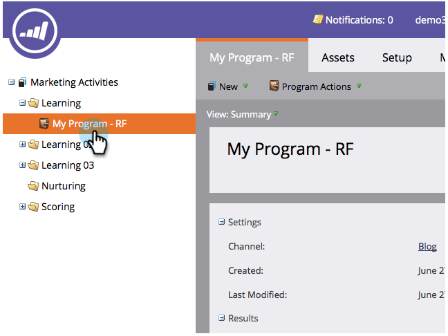

# Creare un elenco avanzato {#create-a-smart-list}

Gli elenchi avanzati consentono di trovare gruppi specifici di persone utilizzando filtri semplici. Ecco come crearne uno.

1. Vai a **Attività di marketing**.

   

1. Selezionare il programma in cui si desidera creare l&#39;elenco smart.

   

1. In **Nuovo**, fai clic su **Nuova risorsa locale**.

   

1. Seleziona **Smart List**.

   

1. Inserisci un **Nome** e fai clic su **Crea**.

   

   Ta-da, ottimo lavoro! Ora aggiungiamo e definiamo alcuni filtri.

   >[!MORELIKETHIS]
   >
   >[Ricerca e aggiunta di filtri a un elenco avanzato](/help/marketo/product-docs/core-marketo-concepts/smart-lists-and-static-lists/creating-a-smart-list/find-and-add-filters-to-a-smart-list.md)
