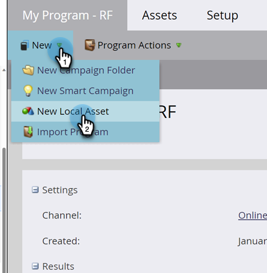

# Creare un elenco avanzato {#create-a-smart-list}

Gli elenchi avanzati consentono di trovare gruppi specifici di persone utilizzando filtri semplici.

1. Passa a **[!UICONTROL Marketing Activities]**.

   

1. Selezionare il programma in cui si desidera creare l&#39;elenco avanzato.

   

1. In **[!UICONTROL New]**, fare clic su **[!UICONTROL New Local Asset]**.

   

1. Seleziona **[!UICONTROL Smart List]**.

   

1. Immettere **[!UICONTROL Name]** e fare clic su **[!UICONTROL Create]**.

   

   Ora aggiungi e definisci alcuni filtri.

   >[!MORELIKETHIS]
   >
   >[Trova e aggiungi filtri a un elenco avanzato](/help/marketo/product-docs/core-marketo-concepts/smart-lists-and-static-lists/creating-a-smart-list/find-and-add-filters-to-a-smart-list.md){target="_blank"}
