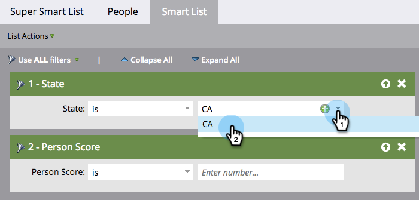

# Definire i filtri dell’elenco avanzato {#define-smart-list-filters}

>[!PREREQUISITES]
>
>* [Creare un elenco avanzato](/help/marketo/product-docs/core-marketo-concepts/smart-lists-and-static-lists/creating-a-smart-list/create-a-smart-list.md){target="_blank"}
>* [Trova e aggiungi filtri agli elenchi avanzati](/help/marketo/product-docs/core-marketo-concepts/smart-lists-and-static-lists/creating-a-smart-list/find-and-add-filters-to-a-smart-list.md){target="_blank"}

Dopo aver [creato un elenco avanzato](/help/marketo/product-docs/core-marketo-concepts/smart-lists-and-static-lists/creating-a-smart-list/create-a-smart-list.md){target="_blank"} e aver aggiunto [filtri](/help/marketo/product-docs/core-marketo-concepts/smart-lists-and-static-lists/creating-a-smart-list/find-and-add-filters-to-a-smart-list.md){target="_blank"}, definire i filtri come segue.

Continuando questo esempio, definisci questi filtri per trovare tutte le persone in California con un punteggio superiore a 50.

1. Passa a **[!UICONTROL Marketing Activities]**.

   

1. Selezionare l&#39;elenco smart desiderato e fare clic sulla scheda **[!UICONTROL Smart List]**.

   

1. Trovare e selezionare &quot;CA&quot; per il filtro **[!UICONTROL State]**.

   

   >[!NOTE]
   >
   >Potresti memorizzare sia &quot;California&quot; che &quot;CA&quot;. Per filtrare entrambi i valori e includere _tutte_ persone dalla California, scopri come [aggiungere più valori a un filtro Elenco avanzato](/help/marketo/product-docs/core-marketo-concepts/smart-lists-and-static-lists/using-smart-lists/add-multiple-values-to-a-smart-list-filter.md){target="_blank"}.

1. Selezionare l&#39;operatore **[!UICONTROL greater than]** e immettere &quot;50&quot;.

   

>[!TIP]
>
>Se ritieni di poter avere alcuni record nel database che contengono indirizzi e-mail incompleti (ad esempio, solo &quot;@adobe.com&quot;), utilizza due filtri per l’indirizzo e-mail quando utilizzi l’operatore &quot;contiene&quot;. Un filtro con &quot;contiene @adobe.com&quot; e un filtro separato con &quot;contiene adobe.com&quot; (omettendo il simbolo @).

Ora sai come creare un elenco avanzato e aggiungere/definire filtri.
