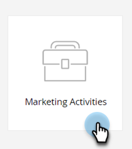
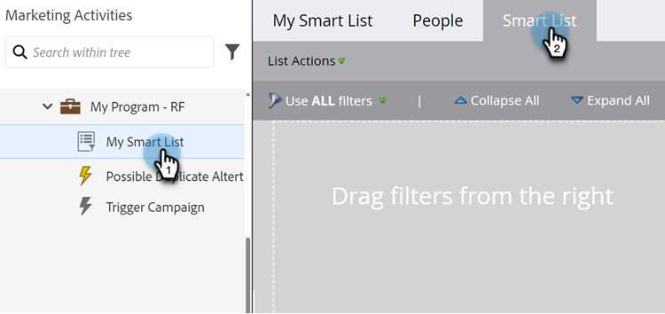

# Trovare e aggiungere filtri a un elenco avanzato {#find-and-add-filters-to-a-smart-list}

Dopo aver [creato un elenco avanzato](/help/marketo/product-docs/core-marketo-concepts/smart-lists-and-static-lists/creating-a-smart-list/create-a-smart-list.md){target="_blank"}, devi aggiungere e [definire](/help/marketo/product-docs/core-marketo-concepts/smart-lists-and-static-lists/creating-a-smart-list/define-smart-list-filters.md){target="_blank"} filtri. Ecco come trovare e aggiungere filtri.

In questo esempio, troviamo tutte le persone in California con un punteggio superiore a 50.

>[!TIP]
>
>Esplora l’albero a destra: i filtri sono molto potenti e dispongono di un’ampia varietà di funzioni possibili.

1. Passa a **[!UICONTROL Marketing Activities]**.

   

1. Selezionare l&#39;elenco avanzato a cui si desidera aggiungere i filtri e fare clic sulla scheda **[!UICONTROL Smart List]**.

   

1. Trova e trascina il filtro **[!UICONTROL State]** nell&#39;area di lavoro.

   

1. Individua e trascina anche il filtro **[!UICONTROL Score]**.

   

Perfetto! Procediamo alla definizione di questi filtri.

>[!MORELIKETHIS]
>
>* [Creare un elenco avanzato](/help/marketo/product-docs/core-marketo-concepts/smart-lists-and-static-lists/creating-a-smart-list/create-a-smart-list.md){target="_blank"}
>* [Definisci filtri elenchi avanzati](/help/marketo/product-docs/core-marketo-concepts/smart-lists-and-static-lists/creating-a-smart-list/define-smart-list-filters.md){target="_blank"}
