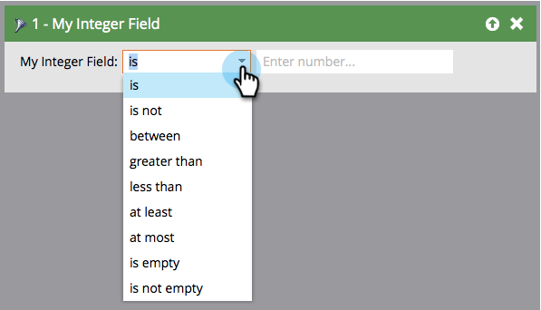

# Glossario degli operatori di filtro elenchi avanzati {#smart-list-filter-operators-glossary}

Un operatore fa parte dell’elenco avanzato, che consente di ottenere specifiche. Ti consente di descrivere il filtro o l’attivatore in un linguaggio semplice. Gli operatori disponibili sono diversi per ogni tipo di campo.

Di seguito è riportato un glossario che descrive ogni insieme di operatori.

## Campi data {#date-fields}

Quando scegli un operatore, il lato destro cambia in modo dinamico.

<table><thead>
  <tr>
    <th>Operatore</th>
    <th>Lato destro</th>
    <th>Descrizione</th>
  </tr></thead>
<tbody>
  <tr>
    <td>è</td>
    <td>Data singola</td>
    <td>Corrispondenza data esatta</td>
  </tr>
  <tr>
    <td>non è</td>
    <td>Data singola</td>
    <td>Qualsiasi data ECCETTO quella specificata</td>
  </tr>
  <tr>
    <td>tra</td>
    <td>Due campi data</td>
    <td>Qualsiasi data compresa tra due date specificate</td>
  </tr>
  <tr>
    <td>nel passato</td>
    <td>Input lingua naturale*</td>
    <td>Vedi il diagramma seguente</td>
  </tr>
  <tr>
    <td>nel passato prima di</td>
    <td>Input lingua naturale*</td>
    <td>Vedi il diagramma seguente</td>
  </tr>
  <tr>
    <td>nel futuro</td>
    <td>Input lingua naturale*</td>
    <td>Vedi il diagramma seguente</td>
  </tr>
  <tr>
    <td>nel futuro dopo</td>
    <td>Input lingua naturale*</td>
    <td>Vedi il diagramma seguente</td>
  </tr>
  <tr>
    <td>nell’intervallo temporale</td>
    <td>Predefiniti (ultimo trimestre, ieri, ecc.)</td>
    <td>Definito nell’elenco a discesa</td>
  </tr>
  <tr>
    <td>dopo</td>
    <td>Data singola</td>
    <td>Tutti i record dopo la data specificata</td>
  </tr>
  <tr>
    <td>prima di</td>
    <td>Data singola</td>
    <td>Tutti i record prima di quello specificato</td>
  </tr>
  <tr>
    <td>il o dopo il</td>
    <td>Data singola</td>
    <td>Come "dopo" ma inclusivo</td>
  </tr>
  <tr>
    <td>entro</td>
    <td>Data singola</td>
    <td>Come "prima" ma inclusivo</td>
  </tr>
  <tr>
    <td>è vuoto</td>
    <td>Nessuno</td>
    <td>Tutti i record senza data</td>
  </tr>
  <tr>
    <td>non è vuoto</td>
    <td>Nessuno</td>
    <td>Tutti i record con qualsiasi data</td>
  </tr>
</tbody></table>

**&#42;** L&#39;input del linguaggio naturale è cool. Di seguito sono riportati alcuni dei pattern che è possibile immettere:

* 1 ora
* 82 giorni
* 3 settimane
* 14 mesi
* 1 anno

Basta digitare il numero e l&#39;unità e funzionerà!

>[!NOTE]
>
>&quot;Nel passato&quot; _include_ il giorno (fino a quel momento, non dopo) in cui crei il tuo elenco avanzato.

>[!CAUTION]
>
>Quando crei un elenco avanzato utilizzando un filtro per il campo data (ad esempio, Data di nascita, Data di creazione SFDC) e utilizzi i vincoli **[!UICONTROL prima]**, **[!UICONTROL prima o prima]** o **[!UICONTROL prima del]**, l&#39;elenco avanzato includerà anche le persone che non hanno alcun valore in tale campo data.

Utilizza il diagramma seguente per comprendere la differenza tra gli operatori di data.

>[!NOTE]
>
>**Esempio**
>
>I campi data possono diventare complessi quando si lavora con eventi passati e futuri. Ecco un paio di esempi.
>
>**[!UICONTROL In passato]**
>
>Per la tua nuova promozione, utilizza questo operatore per inviare e-mail solo a persone che non si sono abbonate o hanno rinnovato il servizio entro un anno o non sono mai state abbonate.
>
>**[!UICONTROL In futuro dopo]**
>
>Se vuoi vedere clienti che sono pronti per il rinnovo entro 90 giorni, Puoi utilizzare due filtri separati. Prima utilizzare &quot;In futuro dopo 90 giorni&quot; e seconda, &quot;In futuro 91 giorni&quot;. In questo modo chiunque abbia una data compresa tra 90 giorni.

## Campi stringa {#string-fields}

<table><thead>
  <tr>
    <th>Operatore</th>
    <th>Descrizione</th>
  </tr></thead>
<tbody>
  <tr>
    <td>è</td>
    <td>Corrispondenza esatta (senza distinzione maiuscole/minuscole)</td>
  </tr>
  <tr>
    <td>non è</td>
    <td>Qualsiasi cosa TRANNE la corrispondenza esatta</td>
  </tr>
  <tr>
    <td>inizia con</td>
    <td>Prime lettere di corrispondenza stringa</td>
  </tr>
  <tr>
    <td>non inizia con</td>
    <td>Le prime lettere della stringa NON corrispondono</td>
  </tr>
  <tr>
    <td>contiene</td>
    <td>Tutte le lettere insieme nella corrispondenza delle stringhe (ad esempio: california, fortune, quindi)</td>
  </tr>
  <tr>
    <td>non contiene</td>
    <td>Nessuna corrispondenza tra lettere nella stringa. (retro di "contiene")</td>
  </tr>
  <tr>
    <td>è vuoto</td>
    <td>Record privi di valore (NULL)</td>
  </tr>
  <tr>
    <td>non è vuoto</td>
    <td>Record con qualsiasi valore</td>
  </tr>
</tbody>
</table>

>[!TIP]
>
>Utilizza operatori positivi rispetto a negativi. I filtri &quot;Non è&quot; devono cercare l’intero set di dati nella tua istanza, il che può richiedere molto tempo. I filtri &quot;is&quot; positivi possono sfruttare algoritmi di ricerca più efficaci.

## Campi interi {#integer-fields}

<table><thead>
  <tr>
    <th>Operatore</th>
    <th>Descrizione</th>
  </tr></thead>
<tbody>
  <tr>
    <td>è</td>
    <td>Corrispondenza esatta dei numeri ( = 0 restituirà entrambi i lead con 0 e NULL)</td>
  </tr>
  <tr>
    <td>non è</td>
    <td>Qualsiasi cosa TRANNE il numero esatto corrisponde</td>
  </tr>
  <tr>
    <td>tra</td>
    <td>Definisci due valori per trovare tutti nel mezzo (inclusi)</td>
  </tr>
  <tr>
    <td>maggiore di</td>
    <td>Sopra il valore specificato</td>
  </tr>
  <tr>
    <td>minore di</td>
    <td>Minore del valore specificato</td>
  </tr>
  <tr>
    <td>almeno</td>
    <td>Al di sopra del valore specificato (incluso)</td>
  </tr>
  <tr>
    <td>al massimo</td>
    <td>Minore del valore specificato (incluso)</td>
  </tr>
  <tr>
    <td>è vuoto</td>
    <td>Record privi di valore (NULL): zero è un numero, non è NULL</td>
  </tr>
  <tr>
    <td>non è vuoto</td>
    <td>Record con QUALSIASI valore (incluso zero)</td>
  </tr>
</tbody>
</table>

Come potete vedere, questi operatori facilitano l&#39;uso del linguaggio Marketo con fluenza!
