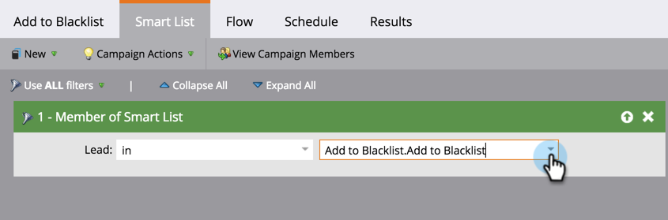

# Aggiungi persona al Inserisco nell&#39;elenco Bloccati di {#add-person-to-blocklist}

L’aggiunta di persone al tuo Elenco Bloccati di impedisce loro di ricevere la tua corrispondenza.

>[!NOTE]
>
>Marketo sta cambiando termini come Blacklist e Whitelist per Inserire nell&#39;elenco Bloccati e Inserire nell&#39;elenco Consentiti il nostro prodotto in modo da. Durante questo aggiornamento, potresti visualizzare i vecchi termini nell’interfaccia utente e nelle schermate della documentazione, nonché i nuovi termini nel testo della documentazione. Ci scusiamo per qualsiasi confusione.

1. [Crea un nuovo programma predefinito](/help/marketo/product-docs/core-marketo-concepts/programs/creating-programs/create-a-program.md) e denominalo **Aggiungi al Inserisco nell&#39;elenco Bloccati di**.

1. Clic **Nuovo** e seleziona **Nuova risorsa locale**.

   

1. Denomina l’elenco e fai clic su **Crea**.

   

1. Aggiungi tutte le persone al tuo **Elenco avanzato** desideri aggiungerlo al tuo Inserisco nell&#39;elenco Bloccati di.

   >[!NOTE]
   >
   >Le persone nel tuo Inserisco nell&#39;elenco Bloccati di non riceveranno e-mail operative.

   

1. Clic **Nuovo** e seleziona **Nuova campagna avanzata**.

   

1. Denomina il **Nuova campagna avanzata**. Fai clic su **Crea**.

   

1. Trascina **Membro di elenco avanzato**.

   

1. Seleziona l’elenco avanzato appena creato.

   

1. Trascina **Modifica valore dati**.

   

1. Per **Flusso**, immetti **Blocca nell&#39;elenco** per **Attributo** e imposta **Nuovo valore** a **true**.

   

1. Il giorno **Pianificazione** , seleziona **Esegui una volta**.

   

1. Seleziona **Esegui ora** e fai clic su **Esegui**.

   

   YAY! Queste persone non riceveranno più e-mail.

   >[!TIP]
   >
   >Creare un [attiva campagna intelligente](/help/marketo/product-docs/core-marketo-concepts/smart-campaigns/creating-a-smart-campaign/create-a-new-smart-campaign.md) utilizzo **Modifica valore dati** con **Blocca nell’elenco è true** per tutte le persone che in futuro avranno attributi che possono essere inseriti nell&#39;elenco Bloccati in modo da poter essere utilizzati in modo più efficiente.
