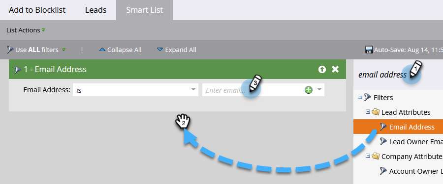

# Aggiungere persone all’elenco Bloccati {#add-person-to-blocklist}

L’aggiunta di persone al tuo Elenco Bloccati di impedisce loro di ricevere la tua corrispondenza.

1. Creare un nuovo [programma predefinito](/help/marketo/product-docs/core-marketo-concepts/programs/creating-programs/create-a-program.md){target="_blank"} e denominarlo &quot;Aggiungi al Inserisco nell&#39;elenco Bloccati di&quot;.

1. Fare clic su **[!UICONTROL New]** e selezionare **[!UICONTROL New Local Asset]**.

   

1. Seleziona **[!UICONTROL Smart List]**.

   

1. Assegna un nome all&#39;elenco e fai clic su **[!UICONTROL Create]**.

   

1. Aggiungi tutte le persone al tuo elenco avanzato che desideri aggiungere al tuo Inserisco nell&#39;elenco Bloccati di.

   

   >[!NOTE]
   >
   >Le persone nel tuo Inserisco nell&#39;elenco Bloccati di non riceveranno e-mail operative.

1. Torna al tuo programma.

   

1. Fare clic su **[!UICONTROL New]** e selezionare **[!UICONTROL New Smart Campaign]**.

   

1. Assegna un nome alla nuova Smart Campaign. Fai clic su **[!UICONTROL Create]**.

   

1. Trascina **[!UICONTROL Member of Smart List]**.

   

1. Seleziona l’elenco avanzato appena creato.

   

1. Fai clic sulla scheda **[!UICONTROL Flow]**. Trascina e rilascia l&#39;azione di flusso **[!UICONTROL Change Data Value]**.

   

1. Nell&#39;elenco a discesa **[!UICONTROL Attribute]** selezionare **[!UICONTROL Block Listed]** e impostare **[!UICONTROL New Value]** su **[!UICONTROL true]**.

   

1. Fare clic sulla scheda **[!UICONTROL Schedule]** e selezionare **[!UICONTROL Run Once]**.

   

1. Seleziona **[!UICONTROL Run Now]** e fai clic su **[!UICONTROL Run]**.

   

1. Fare di nuovo clic su **[!UICONTROL Run]**.

   

Queste persone non riceveranno più e-mail.

>[!TIP]
>
>Crea una [campagna Trigger](/help/marketo/product-docs/core-marketo-concepts/smart-campaigns/creating-a-smart-campaign/create-a-new-smart-campaign.md){target="_blank"} utilizzando **Modifica valore dati** con **Blocco inserito nell&#39;elenco true** per tutte le persone che in futuro avranno gli attributi che possono essere inseriti nell&#39;elenco Bloccati da.
