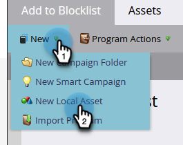
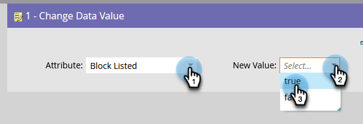
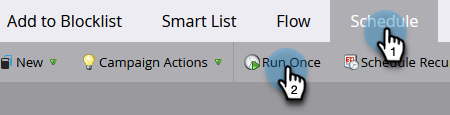

# Aggiungi persona al Inserisco nell&#39;elenco Bloccati di {#add-person-to-blocklist}

L’aggiunta di persone al tuo Elenco Bloccati di impedisce loro di ricevere la tua corrispondenza.

1. Crea un nuovo [programma predefinito](/help/marketo/product-docs/core-marketo-concepts/programs/creating-programs/create-a-program.md){target="_blank"} e denominalo &quot;Aggiungi a Inserisce nell&#39;elenco Bloccati di&quot;.

1. Clic **[!UICONTROL Nuovo]** e seleziona **[!UICONTROL Nuova risorsa locale]**.

   

1. Seleziona **[!UICONTROL Elenco avanzato]**.

   

1. Denomina l’elenco e fai clic su **[!UICONTROL Crea]**.

   

1. Aggiungi tutte le persone al tuo elenco avanzato che desideri aggiungere al tuo Inserisco nell&#39;elenco Bloccati di.

   

   >[!NOTE]
   >
   >Le persone nel tuo Inserisco nell&#39;elenco Bloccati di non riceveranno e-mail operative.

1. Torna al tuo programma.

   

1. Clic **[!UICONTROL Nuovo]** e seleziona **[!UICONTROL Nuova campagna avanzata]**.

   

1. Assegna un nome alla nuova Smart Campaign. Fai clic su **[!UICONTROL Crea]**.

   

1. Trascina **[!UICONTROL Membro di elenco avanzato]**.

   

1. Seleziona l’elenco avanzato appena creato.

   

1. Fai clic su **[!UICONTROL Flusso]** scheda. Trascina la **[!UICONTROL Modifica valore dati]** Azione di flusso.

   

1. In **[!UICONTROL Attributo]** selezione a discesa **[!UICONTROL Blocca nell&#39;elenco]** e imposta **[!UICONTROL Nuovo valore]** a **[!UICONTROL true]**.

   

1. Fai clic su **[!UICONTROL Pianificazione]** e seleziona **[!UICONTROL Esegui una volta]**.

   

1. Seleziona **[!UICONTROL Esegui ora]** e fai clic su **[!UICONTROL Esegui]**.

   

1. Clic **[!UICONTROL Esegui]** di nuovo.

   

Queste persone non riceveranno più e-mail.

>[!TIP]
>
>Creare un [Attiva campagna](/help/marketo/product-docs/core-marketo-concepts/smart-campaigns/creating-a-smart-campaign/create-a-new-smart-campaign.md){target="_blank"} utilizzo **Modifica valore dati** con **Blocca nell’elenco è true** per tutte le persone che in futuro avranno attributi che possono essere inseriti nell&#39;elenco Bloccati in modo da poter essere utilizzati in modo più efficiente.
