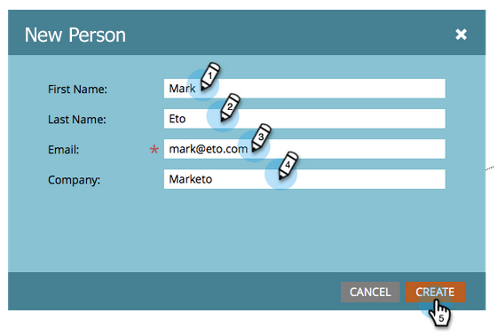

# Creare una persona manualmente {#create-a-person-manually}

Esistono molti modi per coinvolgere una persona in Marketo Engage. Per crearne uno manualmente, segui la procedura riportata di seguito.

>[!CAUTION]
>
>Marketo non supporta gli indirizzi e-mail che contengono emoticon.

1. Passare a **[!UICONTROL Database]**.

   

1. In **[!UICONTROL New]**, fare clic su **[!UICONTROL New Person]**.

   

1. Immettere le informazioni della persona, quindi fare clic su **[!UICONTROL Create]**.

   
