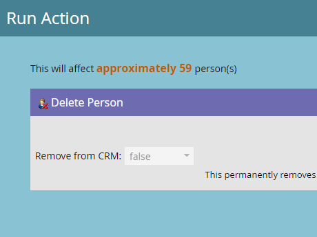

# Eliminare le persone da un elenco o da un elenco smart {#delete-people-in-a-smart-list-or-list}

È possibile eliminare rapidamente e facilmente tutte le persone che si trovano in un elenco o in un elenco smart.

>[!PREREQUISITES]
>
>[Creare un elenco avanzato](/help/marketo/product-docs/core-marketo-concepts/smart-lists-and-static-lists/creating-a-smart-list/create-a-smart-list.md)

1. Vai a **Attività di marketing**.

   

1. Seleziona l’elenco o l’elenco smart che contiene tutte le persone da eliminare e passa alla scheda **Persone** .

   

   >[!CAUTION]
   >
   >Quando si elimina una persona, non si tratta solo di rimuoverla dall&#39;elenco, verranno completamente rimossi dal database.

1. Fare clic su **Seleziona tutto**. È inoltre possibile selezionare alcuni record manualmente utilizzando Ctrl/Comando e facendo clic su.

   

   >[!NOTE]
   >
   >Se i risultati si estendono su più pagine, facendo clic su **Seleziona tutto** verranno selezionate tutte le persone in tutte le pagine.

1. Per rimuovere completamente le persone da Marketo, fai clic su **Elimina persona**.

   

1. Imposta **Rimuovi da CRM** su **true** se desideri eliminare anche i record dal CRM.

   

   >[!CAUTION]
   >
   >Eliminare da Marketo e CRM significa che non sarà mai in grado di recuperare in entrambi i sistemi. Le persone e le loro storie saranno sparite per sempre. Se li riaggiungi in seguito, verranno trattati come nuovi record di zecca.

   >[!NOTE]
   >
   >Se il tuo Marketo non è legato al tuo CRM, l&#39;opzione è disattivata come nello screenshot.

1. Fare clic su **Esegui ora**.

   

1. Se elimini più di 50 persone, questo verrà visualizzato. Digita il numero di persone che stai eliminando, seleziona la casella **Impossibile annullare**, quindi fai clic su **Elimina**.

   

   >[!NOTE]
   >
   >Per visualizzare i risultati dell&#39;eliminazione di massa, fai clic su **Visualizza risultati** nella casella a comparsa Azione flusso singolo nell&#39;angolo superiore destro dello schermo. I tempi di eliminazione possono variare notevolmente, a seconda di diversi fattori.

   Questa è una grande caratteristica, basta essere molto attenti quando lo si utilizza!
