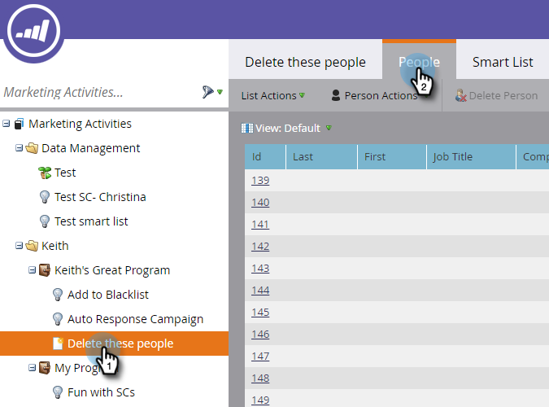
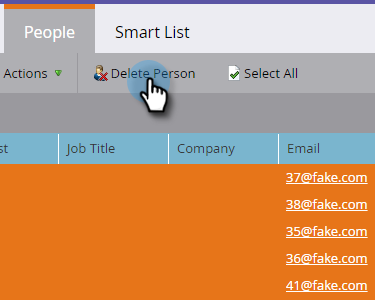
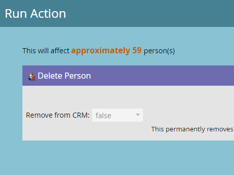
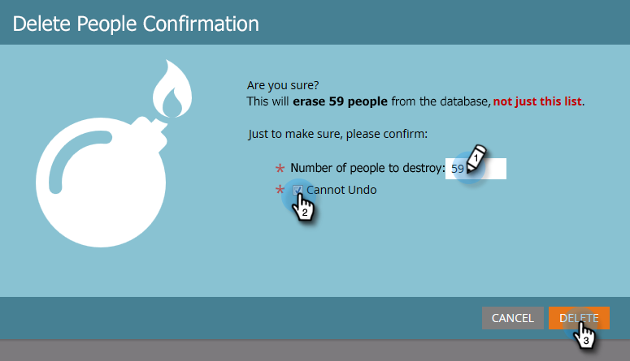

# Eliminare persone in un elenco avanzato o in un elenco {#delete-people-in-a-smart-list-or-list}

È possibile eliminare alcuni o tutti gli utenti inclusi in un elenco o in un elenco avanzato.

>[!PREREQUISITES]
>
>[Creare un elenco avanzato](/help/marketo/product-docs/core-marketo-concepts/smart-lists-and-static-lists/creating-a-smart-list/create-a-smart-list.md)

1. Passa a **[!UICONTROL Marketing Activities]**.

   

1. Selezionare l&#39;elenco o l&#39;elenco avanzato contenente tutte le persone che si desidera eliminare e passare alla scheda **[!UICONTROL People]**.

   

   >[!CAUTION]
   >
   >Quando elimini una persona, non solo la rimuovi dall’elenco, ma la rimuovi completamente dal database.

1. Fai clic su **[!UICONTROL Select All]**. È inoltre possibile scegliere alcuni record utilizzando Ctrl/Comando e facendo clic su.

   

   >[!NOTE]
   >
   >Se i risultati si estendono su più pagine, facendo clic su **[!UICONTROL Select All]** verranno selezionate tutte le persone in tutte le pagine.

1. Per rimuovere completamente le persone da Marketo, fare clic su **[!UICONTROL Delete Person]**.

   

1. Impostare **[!UICONTROL Remove from CRM]** su **[!UICONTROL true]** se si desidera eliminare anche i record dal CRM.

   

   >[!CAUTION]
   >
   >Eliminare da Marketo e CRM significa che non sarà mai in grado di recuperare in entrambi i sistemi. Le persone e le loro storie spariranno per sempre. Se li aggiungi nuovamente in un secondo momento, verranno trattati come record nuovi di zecca.

   >[!NOTE]
   >
   >Se il Marketo non è legato al CRM, l’opzione è disattivata come nella schermata.

1. Fai clic su **[!UICONTROL Run Now]**.

   

1. Se elimini più di 50 persone, visualizzerai questo messaggio. Digitare il numero di persone da eliminare, selezionare la casella **[!UICONTROL Cannot Undo]**, quindi fare clic su **[!UICONTROL Delete]**.

   

   >[!NOTE]
   >
   >Per visualizzare i risultati dell&#39;eliminazione di massa, fare clic su **[!UICONTROL View Results]** nella casella a comparsa Azione flusso singolo nell&#39;angolo superiore destro dello schermo. I tempi di eliminazione possono variare notevolmente, a seconda di più fattori.

   Utilizza questa funzione con cautela.
