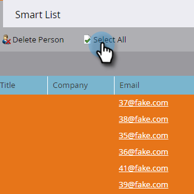

# Eliminare persone in un elenco avanzato o in un elenco {#delete-people-in-a-smart-list-or-list}

Puoi eliminare in modo rapido e semplice alcune/tutte le persone incluse in un elenco o in un elenco avanzato.

>[!PREREQUISITES]
>
>[Creare un elenco avanzato](/help/marketo/product-docs/core-marketo-concepts/smart-lists-and-static-lists/creating-a-smart-list/create-a-smart-list.md)

1. Vai a **Attività di marketing**.

   

1. Seleziona l’elenco o l’elenco avanzato che contiene tutte le persone che desideri eliminare e passa alla sezione **Persone** scheda.

   

   >[!CAUTION]
   >
   >Quando elimini una persona, non solo la rimuovi dall’elenco, ma la rimuovi completamente dal database.

1. Clic **Seleziona tutto**. È inoltre possibile scegliere alcuni record utilizzando Ctrl/Comando e facendo clic su.

   

   >[!NOTE]
   >
   >Se i risultati si estendono su più pagine, fare clic su **Seleziona tutto** seleziona tutte le persone in tutte le pagine.

1. Per rimuovere completamente le persone da Marketo, fai clic su **Elimina persona**.

   

1. Imposta **Rimuovi da CRM** a **true** se desideri eliminare anche i record dal CRM.

   

   >[!CAUTION]
   >
   >Eliminare da Marketo e CRM significa che non sarà mai in grado di recuperare in entrambi i sistemi. Le persone e le loro storie spariranno per sempre. Se li aggiungi nuovamente in un secondo momento, verranno trattati come record nuovi di zecca.

   >[!NOTE]
   >
   >Se il Marketo non è legato al CRM, l’opzione è disattivata come nella schermata.

1. Clic **Esegui ora**.

   

1. Se elimini più di 50 persone, visualizzerai questo messaggio. Digita il numero di persone che stai eliminando, controlla **Impossibile annullare** , quindi fare clic su **Elimina**.

   

   >[!NOTE]
   >
   >Per visualizzare i risultati dell&#39;eliminazione di massa, fare clic su **Visualizza risultati** nella finestra a comparsa Azione flusso singolo nell&#39;angolo superiore destro dello schermo. I tempi di eliminazione possono variare notevolmente, a seconda di più fattori.

   Questa è una funzione straordinaria, fai molta attenzione quando la utilizzi!
