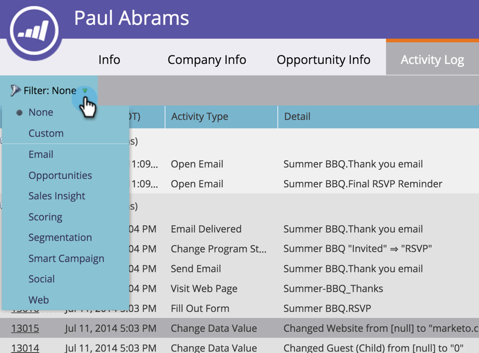

# Filtrare i tipi di attività nel registro attività di una persona {#filter-activity-types-in-the-activity-log-of-a-person}

Cerca le attività che più ti interessano nel registro delle attività.

>[!NOTE]
>
>Ulteriori informazioni su [il registro attività](/help/marketo/product-docs/core-marketo-concepts/smart-lists-and-static-lists/managing-people-in-smart-lists/locate-the-activity-log-for-a-person.md).

1. Vai alla pagina **Dettagli persona** . Fai clic sulla scheda **Registro attività** .

   

1. Seleziona il menu a discesa **Filtro** .

   

## Creazione di filtri personalizzati {#creating-custom-filters}

1. Fai clic sull&#39;elenco a discesa **Filtro** . Seleziona **Personalizzato**.

   

1. Seleziona le attività per cui filtrare. Fare clic su **Salva con nome**.

   

1. Immetti un **nome filtro personalizzato**. Fare clic su **Salva**.

   

   Ora vengono visualizzate solo le attività personali che soddisfano i criteri del filtro.

   

## Filtri salvati di riferimento {#reference-saved-filters}

È possibile accedere ai filtri salvati dal menu a discesa **Filter** .

1. Fai clic sul menu a discesa **Filtri** . Seleziona **Personalizzato**.

   

1. Fai clic su **Filtri salvati**. I filtri salvati sono elencati di seguito.

   
