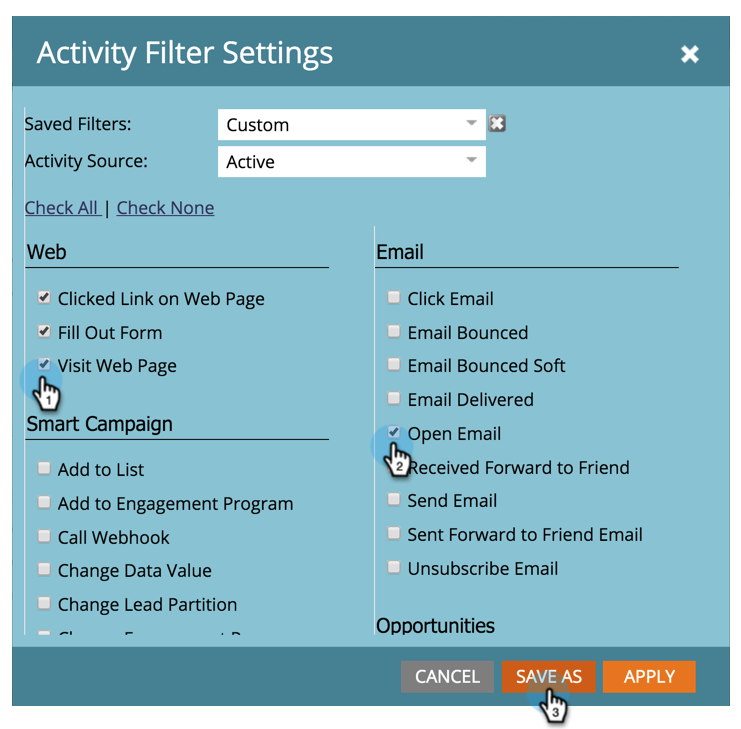
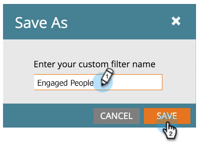
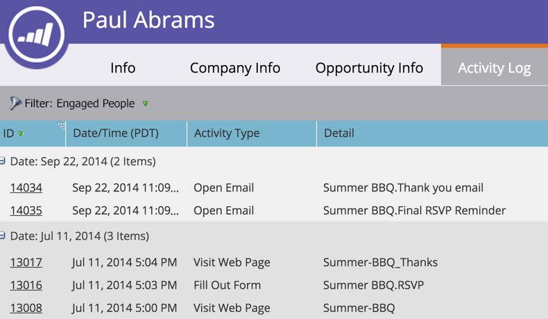

# Filtrare i tipi di attività nel registro attività di una persona {#filter-activity-types-in-the-activity-log-of-a-person}

Cerca le attività che ti interessano di più nel registro delle attività.

>[!NOTE]
>
>Ulteriori informazioni sul [registro attività](/help/marketo/product-docs/core-marketo-concepts/smart-lists-and-static-lists/managing-people-in-smart-lists/locate-the-activity-log-for-a-person.md){target="_blank"}.

1. Passare alla pagina Dettagli persona. Fai clic sulla scheda **[!UICONTROL Activity Log]**.

   

1. Selezionare il menu a discesa **[!UICONTROL Filter]**.

   

## Creazione di filtri personalizzati {#creating-custom-filters}

1. Fare clic sul menu a discesa **[!UICONTROL Filter]**. Seleziona **[!UICONTROL Custom]**.

   

1. Seleziona le attività in base alle quali filtrare. Fai clic su **[!UICONTROL Save As]**.

   

1. Immetti **[!UICONTROL custom filter name]**. Fai clic su **[!UICONTROL Save]**.

   

   Ora vengono visualizzate solo le attività delle persone che soddisfano i criteri del filtro.

   

## Riferimento ai filtri salvati {#reference-saved-filters}

I filtri salvati sono accessibili dal menu a discesa [!UICONTROL Filter].

1. Fare clic sul menu a discesa **[!UICONTROL Filters]**. Seleziona **[!UICONTROL Custom]**.

   

1. Fai clic su **[!UICONTROL Saved Filters]**. I filtri salvati sono elencati di seguito.

   
