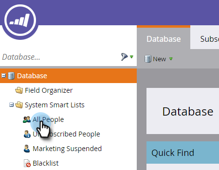

# Individuare il registro attività di una persona {#locate-the-activity-log-for-a-person}

Il registro attività è la fonte ultima di verità. Questa è la storia completa del percorso di una persona in Marketo Engage.

1. Passare a **[!UICONTROL Database]**.

   

1. Seleziona **[!UICONTROL All People]**.

   

1. Fai clic sulla scheda **[!UICONTROL People]**. Selezionare un numero di persona **[!UICONTROL Id]**.

   

1. Fai clic su **[!UICONTROL Activity Log]**.

   

   Ora disponi di una raccolta di tutte le informazioni che si verificano nel tempo per una persona.

   

## Esporta registro attività {#export-activity-log}

Esportare il registro attività di una persona in Excel?

1. Dopo aver seguito i passaggi precedenti, scorri fino alla parte inferiore della pagina e seleziona l’icona Esporta.

   

1. Un file Excel viene scaricato nel browser.

   

   >[!MORELIKETHIS]
   >
   >Ulteriori informazioni su [filtrare il registro attività](/help/marketo/product-docs/core-marketo-concepts/smart-lists-and-static-lists/managing-people-in-smart-lists/filter-activity-types-in-the-activity-log-of-a-person.md){target="_blank"} per visualizzare attività di persona specifiche.
