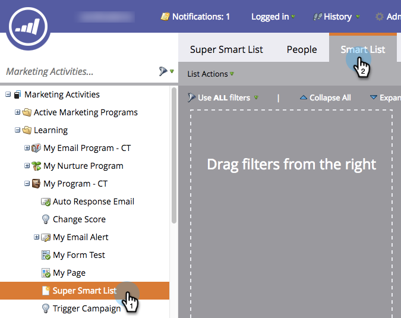
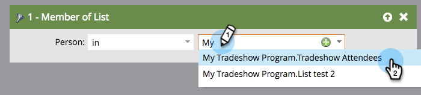

# Utilizzo dei membri dell&#39;elenco in un elenco avanzato {#use-members-of-list-in-a-smart-list}

>[!TIP]
>
>È possibile aggiungere persone a un elenco tramite [Importa](../../../../getting-started/quick-wins/import-a-list-of-people.md) o il passaggio [di flusso](../../../../product-docs/core-marketo-concepts/smart-campaigns/flow-actions/add-to-list.md)Aggiungi a elenco.

Con questo filtro, potete estrarre i membri da un altro elenco facendovi riferimento nelle regole dell&#39;elenco avanzato. Ecco come.

1. Selezionate un elenco avanzato e fate clic sulla scheda Elenco **** avanzato.

   

1. Nel pannello dei filtri a destra, cercate e trascinate il filtro **Membro di elenco** sul quadro.

   

1. Fare clic sull&#39;elenco a discesa o digitare per cercare l&#39;elenco da includere nell&#39;elenco smart.

   

   **Fatto!** In questo esempio, l&#39;elenco smart ora sarà indirizzato solo ai membri dell&#39;elenco e li valuterà in base a qualsiasi altra regola inclusa.

