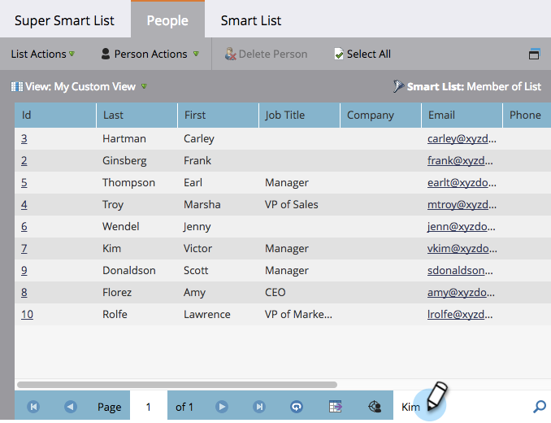

# Utilizzare la ricerca rapida in un elenco o in un elenco avanzato {#use-quick-find-in-a-list-or-smart-list}

Trova una persona dai risultati di un elenco o di un elenco avanzato utilizzando la ricerca rapida.

1. Passa a **[!UICONTROL Marketing Activities]**.

   

1. Selezionare l&#39;elenco smart che si desidera cercare e quindi fare clic sulla scheda **[!UICONTROL People]**.

   

## Trova persone utilizzando le informazioni personali {#find-people-using-personal-info}

1. Nella casella **[!UICONTROL Quick Find]** nella parte inferiore della schermata, digitare una parola chiave (**nome personale**, **indirizzo e-mail** o **titolo processo**).

   

1. Al termine, premi Invio o fai clic sull’icona di ricerca.

## Trovare persone utilizzando il nome di una società {#find-people-using-a-company-name}

1. Per trovare una società, digitare `[company]` nella casella Ricerca rapida, seguito da una parte del nome della società che si sta cercando.

   

1. Al termine, premi Invio o fai clic sull’icona di ricerca.
