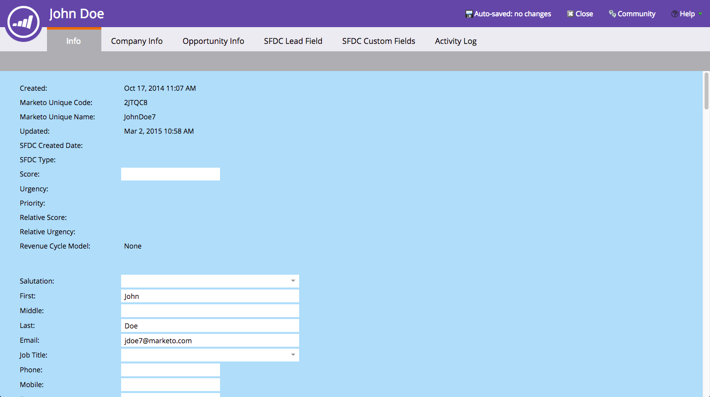

# Utilizzare la pagina Dettagli persona {#using-the-person-detail-page}

La pagina dei dettagli della persona contiene tutte le informazioni che Marketo conosce su una persona. Puoi modificare i dati direttamente da questa pagina.

## Vai alla pagina dei dettagli della persona {#getting-to-person-detail-page}

Ci sono molti modi per aprire persone specifiche. Alcuni esempi sono:

* Dal **Database**, puoi eseguire una ricerca nella Ricerca rapida
* Qualsiasi **elenco avanzato** o elenco
* Scheda **Membri** di un programma
* **Visualizzare i membri della campagna** in una campagna avanzata
* Alcuni **report**
    

1. Fai doppio clic su una persona o fai clic sull’ID a sinistra.

   

1. Verrà aperta la schermata dei dettagli della persona.

   

## Organizzazione pagina - Salesforce {#page-organization-salesforce}

Le informazioni sulla persona sono suddivise nelle seguenti schede:

| Scheda | Descrizione |
|---|---|
| Info | Informazioni di contatto e campi personalizzati su una persona. |
| Informazioni società | Informazioni e indirizzo dell’azienda della persona. |
| Informazioni sull’opportunità | Informazioni sull’opportunità sincronizzate da Salesforce. |
| Campo lead SFDC | Campi Salesforce incorporati. |
| Campo personalizzato SFDC | Campi Salesforce personalizzati. |
| Registro delle attività | Tutte le attività relative alla persona. |

## Organizzazione pagina - Microsoft Dynamics {#page-organization-microsoft-dynamics}

| Scheda | Descrizione |
|---|---|
| Info | Informazioni di contatto e campi personalizzati su una persona. |
| Informazioni società | Informazioni e indirizzo dell’azienda della persona. |
| Informazioni sull’opportunità | Informazioni sull’opportunità sincronizzate da Microsoft. |
| Campi personalizzati Microsoft | Campi Microsoft personalizzati. |
| Campo lead Microsoft | Campi Microsoft incorporati. |
| Registro delle attività | Tutte le attività relative alla persona. |

>[!NOTE]
>
>È inoltre possibile visualizzare le informazioni sull&#39;opportunità [inserite tramite API](https://experienceleague.adobe.com/en/docs/marketo-developer/marketo/rest/lead-database/opportunities) per le istanze non sincronizzate con un CRM.

## Modifica di un campo {#editing-a-field}

Molti campi sono modificabili. Per aggiornare le informazioni di una persona, digita un nuovo valore e fai clic all’esterno del campo per salvare.

## Campi predefiniti di Marketo prima della sincronizzazione CRM {#marketo-default-fields-prior-to-crm-sync}

|   |  |  |  |  |
|---|---|---|---|---|
| Indirizzo | Entrata annuale | IP anonimo | Indirizzo di fatturazione | Città di fatturazione |
| Paese di fatturazione | Codice postale di fatturazione | Stato di fatturazione | Città | Nome della società |
| Paese | Data creazione | Data di nascita | Dipartimento | Non effettuare la chiamata |
| Non chiamare causa | Motivo per cui non effettuare la chiamata | Indirizzo e-mail | E-mail non valida | E-mail causa non valida |
| ID azienda esterna | ID dell&#39;addetto alle vendite esterno | Numero di fax | Nome | Nome completo |
| Settore | Città dedotta | Azienda in oggetto | Paese in oggetto | Area metropolitana dedotta |
| Prefisso telefonico dedotto | Codice postale dedotto | Area geografica dello stato dedotta | È anonimo | È cliente |
| È partner | Professione | Cognome | Valutazione | Punteggio |
| Source della persona | Stato | Numero di telefono | Nome visualizzato [!DNL Facebook] per Marketo Social | ID [!DNL Facebook] Marketo Social |
| URL foto di Marketo Social [!DNL Facebook] | URL profilo [!DNL Facebook] di Marketo Social | Portata di Marketo Social [!DNL Facebook] | [!DNL Facebook] iscrizioni con riferimento a Marketo Social | Visite di riferimento [!DNL Facebook] per Marketo Social |
| Genere social Marketo | Ultima iscrizione riferimento a Marketo Social | Ultima visita di riferimento di Marketo Social | Nome visualizzato [!DNL LinkedIn] per Marketo Social | ID [!DNL LinkedIn] Marketo Social |
| URL foto di Marketo Social [!DNL LinkedIn] | URL profilo [!DNL LinkedIn] di Marketo Social | Portata di Marketo Social [!DNL LinkedIn] | [!DNL LinkedIn] iscrizioni con riferimento a Marketo Social | Visite di riferimento [!DNL LinkedIn] per Marketo Social |
| ID Marketo Social Syndication | Totale iscrizioni inoltrate Social Marketo | Totale visite inoltrate Social Marketo | Nome visualizzato [!DNL Twitter] per Marketo Social | ID [!DNL Twitter] Marketo Social |
| URL foto di Marketo Social [!DNL Twitter] | URL profilo [!DNL Twitter] di Marketo Social | Portata di Marketo Social [!DNL Twitter] | [!DNL Twitter] iscrizioni con riferimento a Marketo Social | Visite di riferimento [!DNL Twitter] per Marketo Social |
| Secondo nome | Numero di cellulare | Numero dipendenti | Numero di telefono | Codice di avviamento postale |
| Priorità | Punteggio relativo | Ruolo | Formula di saluto | Codice SIC (Standard Industrial Classification) |
| Sito | Stato | Annulla l&#39;iscrizione | Motivo di annullamento dell&#39;iscrizione | Data di aggiornamento |
| Urgenza | Sito web |  |  |  |

>[!NOTE]
>
>Alcuni campi sono _non_ modificabili:
>
>* Registro delle attività
>* Informazioni sull&#39;azienda
>* Opportunità per i contatti SFDC
>* Alcuni campi specifici di Marketo, come Data di creazione e Tipo di Source originale.
>
>Ulteriori informazioni sui [campi gestiti dal sistema](/help/marketo/product-docs/administration/field-management/understanding-system-managed-fields.md){target="_blank"}.

>[!MORELIKETHIS]
>
>[Creazione di una scheda personalizzata per la pagina dettagli persona](/help/marketo/product-docs/administration/settings/creating-a-custom-tab-for-the-person-detail-page.md){target="_blank"}
