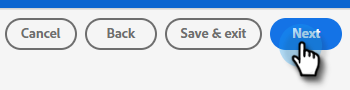

# Inviare un segmento Adobe Experience Cloud a un elenco statico di Marketo {#push-an-adobe-experience-cloud-segment-to-a-marketo-static-list}

Questa funzione ti consente di inviare in push a Marketo i segmenti situati nel Adobe Experience Platform sotto forma di un elenco statico.

>[!PREREQUISITES]
>
>* [Crea un ](/help/marketo/product-docs/administration/users-and-roles/create-an-api-only-user.md) utente API in Marketo.
>* Quindi, vai a **Amministratore** > **Punto di avvio**. Trova il nome del ruolo appena creato e fai clic su **Visualizza dettagli**. Copia e salva le informazioni in **ID client** e **Segreto client**, in quanto ne avrai bisogno per questa funzione.

1. Accedi a [Adobe Experience Platform](https://experience.adobe.com/).

   

1. Fai clic sull&#39;icona della griglia e seleziona **Experience Platform**.

   

1. Nella barra di navigazione a sinistra, fai clic su **Destinazioni**.

   

1. Fare clic su **Catalogo**.

   

1. Trova il riquadro del Marketo Engage e fai clic su **Attiva**.

   

1. In Tipo di account fare clic sul pulsante di opzione **Nuovo account**. Immetti le credenziali Marketo e fai clic su **Connetti a destinazione**.

   

   >[!NOTE]
   >
   >Per trovare il tuo Munchkin ID vai su **Amministratore** > **Munchkin** (fa anche parte dell&#39;URL Marketo dopo l&#39;accesso). ID client/Segreto è necessario seguire i prerequisiti nella parte superiore di questo articolo.

1. &quot;Connesso&quot; dovrebbe apparire sotto le tue credenziali. Fai clic su **Successivo** nell&#39;angolo in alto a destra.

   

1. Immetti un **Nome** e una descrizione _facoltativa_. Fai clic su **Crea destinazione**.

   >[!NOTE]
   >
   >La scelta di qualcosa dalle azioni di marketing è anche facoltativa. Marketo non utilizza tali informazioni al momento, ma probabilmente lo farà presto.

   

1. Fare clic su **Avanti**.

   

1. Scegli il segmento desiderato e fai clic su **Avanti**.

   

   >[!NOTE]
   >
   >I segmenti negli elenchi statici sono 1:1. Se scegli più segmenti qui, dovrai mappare ogni segmento a un elenco statico specifico nella scheda Pianificazione segmento .

1. Fai clic su **Aggiungi nuova mappatura**.

   

1. Fai clic sull’icona del cursore.

   

1. Scegli il campo pertinente che contiene l’indirizzo e-mail che identifica l’utente. Al termine, fai clic su **Seleziona** .

   

   

   >[!NOTE]
   >
   >L&#39;esempio scelto può essere molto diverso dalla selezione.

1. Fai clic sull’icona di mappatura.

   

1. Scegli il campo di destinazione e fai clic su **Seleziona**.

   

1. Fare clic su **Avanti**.

   

1. _In Marketo_, crea un elenco statico oppure trova e seleziona uno degli elenchi già creati. Copia l&#39;ID di mappatura dalla fine dell&#39;URL.

   

   >[!NOTE]
   >
   >Per risultati ottimali, accertati che l’elenco a cui fai riferimento in Marketo sia vuoto.

1. In Adobe Experience Platform, immetti l&#39;ID appena copiato. Scegli la data di inizio. Le persone si sincronizzano continuamente fino alla data di fine scelta. Per una sincronizzazione indefinita, lascia vuota la data di fine. Al termine, fai clic su **Avanti**.

   

1. Conferma le modifiche e fai clic su **Fine**.

   
