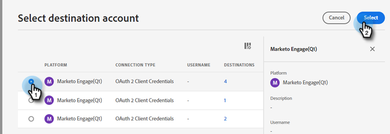

# Inviare un segmento Adobe Experience Platform a un elenco statico di Marketo {#push-an-adobe-experience-platform-segment-to-a-marketo-static-list}

Questa funzione ti consente di inviare in push a Marketo i segmenti situati nel Adobe Experience Platform sotto forma di un elenco statico.

>[!PREREQUISITES]
>
>* [Modificare il ruolo API](/help/marketo/product-docs/administration/users-and-roles/create-delete-edit-and-change-a-user-role.md#edit-an-existing-role) per assicurarsi che abbia **Persona di lettura-scrittura** (disponibile nel menu a discesa API di accesso ).
>* [Creare un utente API](/help/marketo/product-docs/administration/users-and-roles/create-an-api-only-user.md) in Marketo.
>* Vai a **Amministratore** > **Punto di avvio**. Trova il nome del ruolo appena creato e fai clic su **Visualizza dettagli**. Copia e salva le informazioni in **ID client** e **Segreto client**, in quanto potrebbe essere necessario per il passaggio 7.
>* In Marketo, crea un elenco statico oppure trova e seleziona quello già creato. Ti servirà il suo ID.

1. Accedi a [Adobe Experience Platform](https://experience.adobe.com/).

   

1. Fai clic sull’icona della griglia e seleziona **Experience Platform**.

   

1. Nel menu di navigazione a sinistra, fai clic su **Destinazioni**.

   

1. Fai clic su **Catalogo**.

   

1. Trova il riquadro del Marketo Engage e fai clic su **Attiva**.

   

1. Fai clic su **Configurare una nuova destinazione**.

   

1. In Tipo di conto selezionare il pulsante di opzione Esistente o Nuovo account (in questo esempio, stiamo scegliendo **Account esistente**). Fai clic sull’icona Seleziona account .

   

   >[!NOTE]
   >
   >Se scegli Nuovo account, puoi trovare il tuo Munchkin ID andando a **Amministratore** > **Munchkin** (fa anche parte del tuo URL Marketo una volta effettuato l’accesso). ID client/Segreto è necessario seguire i prerequisiti nella parte superiore di questo articolo.

1. Scegli l’account di destinazione e fai clic su **Seleziona**.

   

1. Immettere una destinazione **Nome** e una descrizione facoltativa. Fai clic sul menu a discesa Creazione persona e scegli &quot;Fai corrispondere le persone esistenti di Marketo e crea le persone mancanti in Marketo&quot; _o_ &quot;Solo persone Marketo esistenti&quot; In questo esempio scegliamo il primo.

   

   >[!NOTE]
   >
   >Se scegli &quot;Match Existing Marketo People Only&quot; (Solo persone esistenti), dovrai mappare solo l&#39;e-mail e/o l&#39;ECID, in modo da poter saltare i passaggi 13-16.

1. Questa sezione è facoltativa. Fai clic su **Crea** per saltare.

   

1. Seleziona la destinazione creata e fai clic su **Successivo**.

   

1. Scegli il segmento da inviare a Marketo e fai clic su **Successivo**.

   

   >[!NOTE]
   >
   >Se scegli più segmenti, dovrai mappare ciascun segmento a un elenco statico specifico nella scheda Pianificazione segmento .

   >[!IMPORTANT]
   >
   >Dopo che un segmento è stato attivato per la prima volta nella destinazione Marketo, può essere necessario eseguire il backfill dei profili che erano già presenti nel segmento prima dell’attivazione della destinazione Marketo **fino a 24 ore**. In futuro, qualsiasi profilo ora viene aggiunto al segmento, verrà aggiunto immediatamente a Marketo.

1. Fai clic su **Aggiungi nuova mappatura**.

   

1. Fai clic sull’icona di mappatura.

   

1. Mappa nome selezionando **firstName** e facendo clic su **Seleziona**.

   

1. Mappa il cognome e il nome della società facendo clic su **Aggiungi nuova mappatura** di nuovo e ripetendo il passaggio 15 due volte, scegliendo **lastName** e poi **companyName**.

   

1. Ora è il momento di mappare l’indirizzo e-mail. Fai clic su **Aggiungi nuova mappatura** di nuovo.

   

1. Fai clic sull’icona di mappatura.

   

1. Fai clic sul pulsante di opzione Seleziona namespace identità , scegli  **E-mail**, quindi fai clic su **Seleziona**.

   

   >[!IMPORTANT]
   >
   >Mappatura di e-mail e/o ECID da **Namespace Identity** tab è la cosa più importante da fare per garantire che la persona corrisponda in Marketo. La mappatura di e-mail garantirà la percentuale di corrispondenza più elevata.

1. Ora è il momento di scegliere i campi di origine. Per e-mail, fai clic sull’icona del cursore.

   

1. Fai clic sul pulsante di opzione Seleziona namespace identità , trova e seleziona **E-mail**, quindi fai clic su **Seleziona**.

   

1. Per scegliere il campo di origine Nome società, fare clic sull&#39;icona del cursore nella riga corrispondente.

   

1. Lascia selezionata l’opzione Seleziona attributi . Cerca &quot;azienda&quot; e seleziona **companyName**, quindi fai clic su **Seleziona**.

   

1. Mappare i campi di origine per Cognome e Nome facendo clic due volte sull&#39;icona del cursore per ciascuno e ripetendo il Passaggio 23, scegliendo **lastName** e poi **firstName**.

   

1. Fai clic su **Successivo**.

   

1. A questo punto sarà necessario l’ID della tua lista. Fai clic sulla scheda nel browser in cui è aperto l’elenco statico Marketo (oppure apri una nuova scheda e seleziona l’elenco statico desiderato).

   

   >[!NOTE]
   >
   >Per ottenere risultati ottimali, utilizzare un elenco di Marketi Engage vuoto.

1. Evidenzia e copia l’ID elenco alla fine dell’URL.

   

1. Incolla l&#39;ID appena copiato in Mapping ID (ID mappatura) e fai clic su **Successivo**.

   

1. Fai clic su **Fine**.

   
