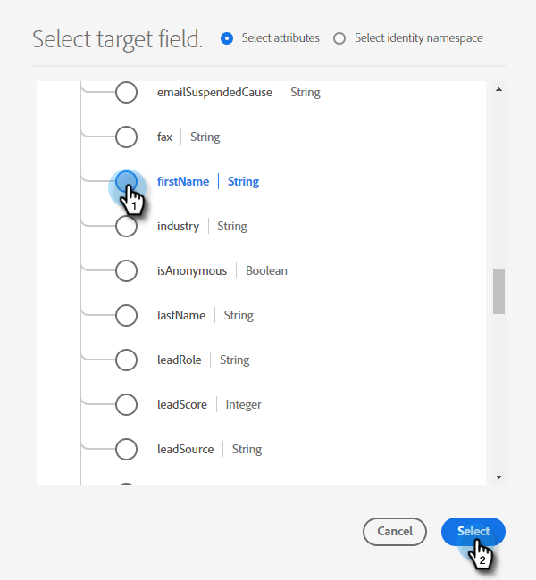
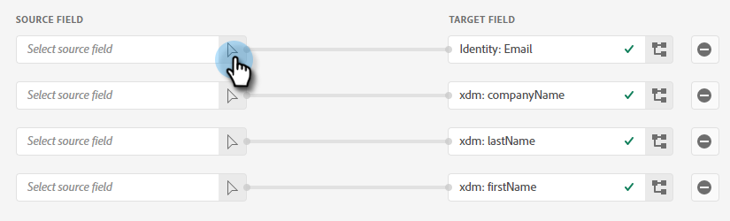

# Invio di un segmento Adobe Experience Platform a un elenco statico Marketo {#push-an-adobe-experience-platform-segment-to-a-marketo-static-list}

Questa funzione consente di inviare a Marketo Engage i segmenti presenti nel Adobe Experience Platform sotto forma di elenco statico.

>[!PREREQUISITES]
>
>* [Modifica il ruolo API](/help/marketo/product-docs/administration/users-and-roles/create-delete-edit-and-change-a-user-role.md#edit-an-existing-role){target="_blank"} per assicurarti che disponga dell&#39;autorizzazione **Persona di lettura/scrittura** (disponibile nel menu a discesa API di Access).
>* [Crea un utente API](/help/marketo/product-docs/administration/users-and-roles/create-an-api-only-user.md){target="_blank"} in Marketo.
>* Vai a **[!UICONTROL Admin]** > **[!UICONTROL Launchpoint]**. Trovare il nome del ruolo appena creato e fare clic su **[!UICONTROL View Details]**. Copiare e salvare le informazioni in **[!UICONTROL Client ID]** e **[!UICONTROL Client Secret]**, in quanto potrebbero essere necessarie per il passaggio 7.
>* In Marketo, crea un elenco statico oppure individuane e selezionane uno già creato. Avrai bisogno del suo ID.

1. Accedi a [Adobe Experience Platform](https://experience.adobe.com/){target="_blank"}.

   

1. Fare clic sull&#39;icona della griglia e selezionare **[!UICONTROL Experience Platform]**.

   

1. Nella barra di spostamento a sinistra, fare clic su **[!UICONTROL Destinations]**.

   

1. Fai clic su **[!UICONTROL Catalog]**.

   

1. Trovare il riquadro Marketo Engage e fare clic su **[!UICONTROL Activate]**.

   

1. Fai clic su **[!UICONTROL Configure New Destination]**.

   

1. In Tipo di account, selezionare il pulsante di opzione Account esistente o nuovo (in questo esempio, si sta scegliendo **[!UICONTROL Existing Account]**). Fai clic sull’icona Seleziona account.

   

   >[!NOTE]
   >
   >Se scegli un nuovo account, puoi trovare il tuo Munchkin ID andando in **[!UICONTROL Admin]** > **[!UICONTROL Munchkin]** (fa anche parte dell&#39;URL Marketo una volta effettuato l&#39;accesso). ID client/Segreto dovrebbe essere possibile seguire i prerequisiti nella parte superiore di questo articolo.

1. Scegliere l&#39;account di destinazione e fare clic su **[!UICONTROL Select]**.

   

1. Immettere una destinazione **[!UICONTROL Name]** e una descrizione facoltativa. Fare clic sull&#39;elenco a discesa Creazione persona e scegliere &quot;Abbina persone Marketo esistenti e crea persone mancanti in Marketo&quot; _o_ &quot;Abbina solo persone Marketo esistenti&quot; (in questo esempio stiamo scegliendo la prima). È inoltre necessario scegliere **[!UICONTROL Workspace]**.

   

   >[!NOTE]
   >
   >Se scegli &quot;[!UICONTROL Match Existing Marketo People Only]&quot;, dovrai mappare solo l&#39;e-mail e/o l&#39;ECID, quindi puoi saltare i passaggi 13-16.

1. Questa sezione è facoltativa. Fai clic su **[!UICONTROL Create]** per saltare.

   

1. Selezionare la destinazione creata e fare clic su **[!UICONTROL Next]**.

   

1. Scegliere il segmento da inviare a Marketo e fare clic su **[!UICONTROL Next]**.

   

   >[!NOTE]
   >
   >Se scegli più segmenti, dovrai mappare ogni segmento a un elenco statico specificato nella scheda [!UICONTROL Segment Schedule].

   >[!IMPORTANT]
   >
   >Dopo che un segmento è stato attivato nella destinazione Marketo per la prima volta, il backfill di profili già presenti nel segmento prima dell&#39;attivazione della destinazione Marketo può richiedere _fino a 24 ore_. In futuro, ogni volta che i profili verranno aggiunti al segmento, verranno aggiunti immediatamente a Marketo.

1. Fai clic su **[!UICONTROL Add New Mapping]**.

   

1. Fai clic sull’icona di mappatura.

   

1. Scegliere gli attributi desiderati e fare clic su **[!UICONTROL Select]**. In questo esempio, scegliamo nome, cognome e indirizzo e-mail.

   

   >[!NOTE]
   >
   >È possibile mappare gli attributi da Experience Platform a qualsiasi attributo a cui la tua organizzazione ha accesso in Marketo Engage. Utilizza [Descrizione richiesta API](https://experienceleague.adobe.com/it/docs/marketo-developer/marketo/rest/lead-database/lead-database#describe){target="_blank"} per recuperare i campi attributo a cui la tua organizzazione ha accesso.

1. Mappare il cognome e il nome della società facendo nuovamente clic su **[!UICONTROL Add New Mapping]** e ripetendo due volte il passaggio 15, scegliendo **[!UICONTROL lastName]** e quindi **[!UICONTROL companyName]**.

   

1. Ora è il momento di mappare l’indirizzo e-mail. Fare di nuovo clic su **[!UICONTROL Add New Mapping]**.

   

1. Fai clic sull’icona di mappatura.

   

1. Fare clic sul pulsante di scelta Seleziona spazio dei nomi identità, scegliere **[!UICONTROL Email]**, quindi fare clic su **[!UICONTROL Select]**.

   

   >[!IMPORTANT]
   >
   >La mappatura di e-mail e/o ECID dalla scheda **[!UICONTROL Identity Namespace]** è la cosa più importante da fare per garantire che la persona corrisponda in Marketo. La mappatura dell’e-mail garantirà la percentuale di corrispondenza più elevata.

1. Ora è il momento di scegliere i campi sorgente. Per l’e-mail, fai clic sull’icona del cursore.

   

1. Fare clic sul pulsante di scelta Seleziona spazio dei nomi identità, trovare e selezionare **[!UICONTROL Email]**, quindi fare clic su **[!UICONTROL Select]**.

   

1. Per scegliere il campo di origine Nome società, fare clic sull&#39;icona del cursore nella riga corrispondente.

   

1. Lasciare selezionato il pulsante di opzione Seleziona attributi. Cercare &quot;company&quot; e selezionare **[!UICONTROL companyName]**, quindi fare clic su **[!UICONTROL Select]**.

   

1. Mappare i campi di origine per Cognome e Nome facendo clic sull&#39;icona del cursore per ogni campo e ripetendo due volte il passaggio 23, scegliendo **[!UICONTROL lastName]** e quindi **[!UICONTROL firstName]**.

   

1. Fai clic su **[!UICONTROL Next]**.

   

1. Rivedi le modifiche e fai clic su **[!UICONTROL Finish]**.

   
