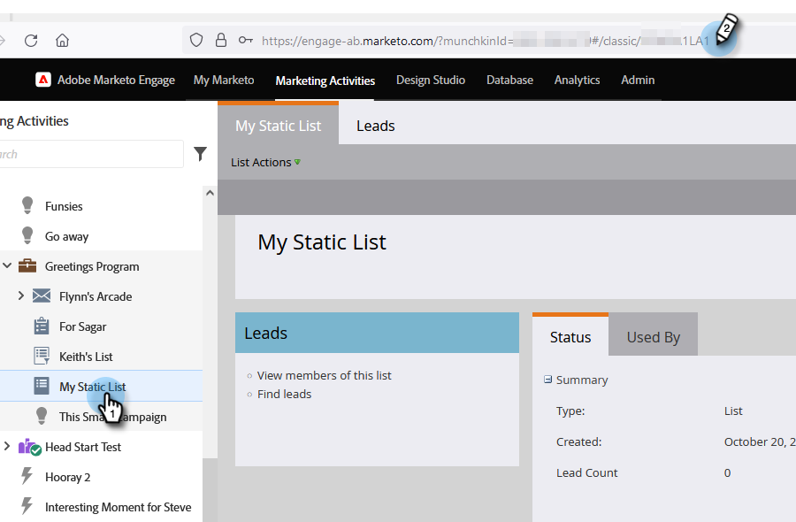

# Clona push {#push-clone}

Questa funzione ti consente di inviare in push a Marketo i segmenti situati nel Adobe Experience Platform sotto forma di un elenco statico.

>[!PREREQUISITES]
>
>* [Creare un utente API](/help/marketo/product-docs/administration/users-and-roles/create-an-api-only-user.md) in Marketo.
>* Quindi, vai a **Amministratore** > **Punto di avvio**. Trova il nome del ruolo appena creato e fai clic su **Visualizza dettagli**. Copia e salva le informazioni in **ID client** e **Segreto client**, poiché ne avrai bisogno per questa funzione.

1. Accedi a [Adobe Experience Platform](https://experience.adobe.com/).

   

1. Fai clic sull’icona della griglia e seleziona **Experience Platform**.

   

1. Nel menu di navigazione a sinistra, fai clic su **Destinazioni**.

   

1. Fai clic su **Catalogo**.

   

1. Trova il riquadro del Marketo Engage e fai clic su **Attiva segmenti**.

   

1. Fai clic su **Configurare una nuova destinazione**.

1. In Tipo di conto scegliere Account esistente o **Nuovo account** pulsante di scelta (in questo esempio, scegliamo **Nuovo account**). Immetti le tue credenziali Marketo.

   

   >[!NOTE]
   >
   >Puoi trovare il tuo Munchkin ID andando a **Amministratore** > **Munchkin** (fa anche parte del tuo URL Marketo una volta effettuato l’accesso). ID client/Segreto è necessario seguire i prerequisiti nella parte superiore di questo articolo.

1. In Creazione di persona, scegli &quot;Corrispondenza con solo le persone esistenti&quot; o &quot;Confronta le persone esistenti e crea le persone mancanti in Marketo&quot;. In questa opzione scegliamo la seconda.

PICC

1. &quot;Connesso&quot; dovrebbe apparire sotto le tue credenziali. Fai clic su **Successivo** nell&#39;angolo in alto a destra.

   

1. Inserisci un **Nome** e _facoltativo_ Descrizione. Fai clic su **Crea destinazione**.

   >[!NOTE]
   >
   >La scelta di qualcosa dalle azioni di marketing è anche facoltativa. Marketo non utilizza tali informazioni al momento, ma probabilmente lo farà presto.

   

1. Fai clic su **Successivo**.

   

1. Scegli il segmento desiderato e fai clic su **Successivo**.

   

   >[!NOTE]
   >
   >Se scegli più segmenti qui, dovrai mappare ogni segmento a un elenco statico specifico nella scheda Pianificazione segmento .

1. Fai clic su **Aggiungi nuova mappatura**.

   

1. Fai clic sull’icona del cursore.

   

1. Scegli la **Seleziona attributi** o **Seleziona namespace identità** pulsante di scelta (in questo esempio, stiamo scegliendo Attributi).

   

   >[!NOTE]
   >
   >Se hai scelto **Seleziona namespace identità**, dopo aver effettuato la selezione, passa al passaggio 15.

1. Scegli il campo pertinente che contiene l’indirizzo e-mail che identifica l’utente. Fai clic su **Seleziona** al termine.

   

   

   >[!NOTE]
   >
   >L&#39;esempio scelto può essere molto diverso dalla selezione.

1. Fai clic sull’icona di mappatura.

   

1. Scegli **Seleziona namespace identità**.

   

   >[!IMPORTANT]
   >
   >Gli attributi di mappatura sono facoltativi. Mappatura di e-mail e/o ECID da **Namespace Identity** tab è la cosa più importante da fare per garantire che la persona corrisponda in Marketo. La mappatura di e-mail garantirà la percentuale di corrispondenza più elevata.

1. Scegli tra ECID o E-mail. In questo esempio scegliamo **E-mail**.

   

1. Fai clic su **Successivo**.

   

   >[!NOTE]
   >
   >Le identità vengono utilizzate per cercare le corrispondenze in Marketo. Se viene trovata una corrispondenza, la persona viene aggiunta all’elenco statico. Se non viene trovata una corrispondenza, queste persone vengono eliminate (ovvero, non create in Marketo).

1. _In Marketo_, crea un elenco statico oppure trova e seleziona un elenco già creato. Copia l&#39;ID di mappatura dalla fine dell&#39;URL.

   

   >[!NOTE]
   >
   >Per risultati ottimali, accertati che l’elenco a cui fai riferimento in Marketo sia vuoto.

1. In Adobe Experience Platform, immetti l&#39;ID appena copiato. Scegli la data di inizio. Le persone si sincronizzano continuamente fino alla data di fine scelta. Per una sincronizzazione indefinita, lascia vuota la data di fine. Fai clic su **Successivo** al termine.

   

1. Conferma le modifiche e fai clic su **Fine**.

   
