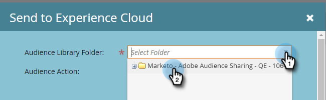

# Inviare un elenco a Adobe Experience Cloud {#send-a-list-to-adobe-experience-cloud}

>[!NOTE]
>
>Una distribuzione compatibile con HIPAA di un’istanza di Marketo Engage non può utilizzare questa funzione.

>[!PREREQUISITES]
>
>[Configura mapping organizzazione Adobe](/help/marketo/product-docs/adobe-experience-cloud-integrations/set-up-adobe-organization-mapping.md){target="_blank"}

## Applicazioni di destinazione supportate {#supported-destination-applications}

* Adobe Advertising Cloud
* Adobe Analytics (_only_ se possiedi una licenza Adobe Audience Manager)
* Adobe Audience Manager
* Adobe Experience Manager
* Adobe Real-time Customer Data Platform
* Adobe Target

## Come inviare un elenco statico {#how-to-send-a-static-list}

Un elenco statico è solo questo, statico. Non verrà apportata alcuna modifica all&#39;elenco in Adobe Experience Cloud, a meno che non vengano apportate manualmente.

1. In Marketo, individua l’elenco da esportare. Fai clic con il pulsante destro del mouse su di esso e seleziona **[!UICONTROL Invia all&#39;Experience Cloud]**.

   

1. Fare clic sul menu a discesa **[!UICONTROL Cartella Audience Manager]** e selezionare la cartella di destinazione desiderata nell&#39;Experience Cloud.

   

1. Scegli se creare un nuovo pubblico o sovrascriverne uno esistente (in questo esempio ne stiamo creando uno nuovo). Immetti il nuovo nome del pubblico e fai clic su **[!UICONTROL Invia]**.

   

1. Fai clic su **[!UICONTROL OK]**.

   

   >[!NOTE]
   >
   >Possono essere necessarie fino a 6-8 ore affinché l’iscrizione al pubblico possa essere completamente popolata in Adobe.

## Come inviare un elenco sincronizzato {#how-to-send-a-synced-list}

La sincronizzazione di un elenco significa che ogni volta che si aggiorna un elenco in Marketo, la modifica viene automaticamente sincronizzata con il relativo pubblico in Adobe Experience Cloud.

1. In Marketo, individua l’elenco da esportare. Fai clic con il pulsante destro del mouse su di esso e seleziona **[!UICONTROL Invia all&#39;Experience Cloud]**.

   

1. Fai clic sul menu a discesa **[!UICONTROL Cartella libreria pubblico]** e seleziona la cartella di destinazione desiderata nell&#39;Experience Cloud.

   

1. Scegli se creare un nuovo pubblico o sovrascriverne uno esistente (in questo esempio ne stiamo creando uno nuovo). Immetti il nuovo nome del pubblico, seleziona la casella **[!UICONTROL Mantieni appartenenza pubblico in Sync]** e fai clic su **[!UICONTROL Invia]**.

   

1. Fare clic su **OK**.

   

## Interrompere una sincronizzazione elenco {#how-to-stop-a-list-sync}

Puoi interrompere la sincronizzazione dell’elenco in qualsiasi momento.

1. In Marketo, individua e fai clic con il pulsante destro del mouse sull’elenco che desideri interrompere la sincronizzazione. Fare clic su **[!UICONTROL Interrompi sincronizzazione elenco]**.

   

1. Selezionare i tipi di pubblico che si desidera interrompere e fare clic su **[!UICONTROL Interrompi]**.

   

1. Fai clic su **[!UICONTROL Interrompi]** per confermare.

   

## Aspetti da considerare {#things-to-note}

**Condivisione in Adobe Analytics**

* Per i clienti che possiedono sia Adobe Audience Manager che Adobe Analytics, questa integrazione consentirà ai tipi di pubblico di essere condivisi da Marketo alle suite di rapporti di Adobe Analytics. Tuttavia, è necessario seguire alcuni passaggi di configurazione aggiuntivi in Adobe Audience Manager per abilitare questa funzione. Rivedi la [documentazione di Adobe Audience Manager](https://experienceleague.adobe.com/docs/analytics/integration/audience-analytics/mc-audiences-aam.html?lang=it){target="_blank"} per ulteriori informazioni su come configurare questa impostazione.

* Se un elenco è vuoto o non ha persone con valori ECID, il nome dell’elenco non verrà inviato per essere referenziato all’esterno del Marketo Engage.

**Utilizzo caratteristiche per clienti Adobe Audience Manager**

Quando avvii un’esportazione di elenchi in Marketo, noterai le seguenti modifiche riportate nell’istanza di Adobe Audience Manager:

* Per tutte le persone nell’elenco esportato, Marketo scriverà una caratteristica utilizzando le e-mail con hash come identificatore multi-dispositivo. Il nome della caratteristica corrisponderà al Nome del pubblico di destinazione specificato durante l’esportazione.
* Per tutti gli ECID che Marketo è riuscito a far corrispondere alle persone nell’elenco esportato, Marketo scriverà una caratteristica utilizzando l’identificatore del dispositivo ECID. Il nome della caratteristica corrisponderà al Nome del pubblico di destinazione specificato durante l’esportazione.
* Marketo creerà anche un segmento nell’istanza dell’Audience Manager utilizzando la caratteristica ECID come unico criterio di segmentazione. Il nome del segmento corrisponderà al Nome del pubblico di destinazione specificato durante l’esportazione.

## Domande frequenti {#faq}

**Perché la dimensione dell&#39;elenco in Marketo è diversa da quella in Adobe?**

Dal punto di vista tecnico, l’integrazione del pubblico funziona sincronizzando i cookie di Marketo Munchkin con il cookie Adobe ECID corrispondente. Marketo può condividere solo i dati di iscrizione per gli utenti per i quali Marketo ha sincronizzato un ECID. Per ottenere i migliori risultati possibili, ti consigliamo di caricare lo script di tracciamento munchkin.js di Marketo in parallelo al codice di tracciamento visitor.js di Adobe su tutte le pagine che ti interessano a scopo di marketing.

**Come funziona la sincronizzazione dei cookie?**

Quando la sincronizzazione dei cookie è abilitata per l’abbonamento a Marketo, munchkin.js di Marketo tenterà di acquisire e memorizzare gli ECID di Adobe per l’organizzazione IMS di Adobe specificata durante la configurazione dell’integrazione e di far corrispondere questi ECID all’identificatore cookie di Marketo corrispondente. Questo consente ai profili utente anonimi di Marketo di arricchirsi con gli Adobe ECID.

È necessario un ulteriore passaggio per associare il profilo utente anonimo a un profilo persona, identificato utilizzando un’e-mail in testo normale. Esattamente come funziona [descritto qui](/help/marketo/product-docs/reporting/basic-reporting/report-activity/tracking-anonymous-activity-and-people.md){target="_blank"}.

**Quali informazioni sono condivise?**

Questa integrazione condivide solo le informazioni sull’iscrizione all’elenco da Marketo ad Adobe (ad esempio, sapendo che la persona X è un membro dell’elenco Y). Tramite questa integrazione, nessun altro attributo di persona viene condiviso con Adobe.
