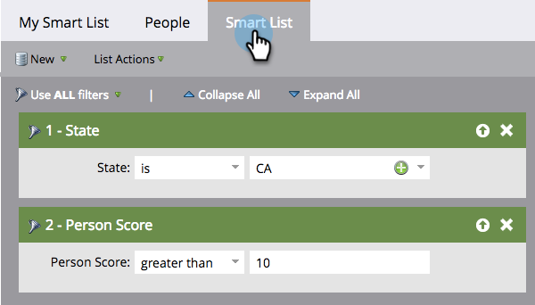

# Informazioni sugli elenchi avanzati {#understanding-smart-lists}

Gli elenchi avanzati consentono di trovare gruppi specifici di persone utilizzando filtri semplici. Vengono utilizzati in tutto Marketo, ad esempio in campagne intelligenti, programmi, rapporti, segmentazioni, modelli di business, programmi di coinvolgimento, contenuti dinamici e altro ancora. A seconda delle tue esigenze, è possibile creare elenchi avanzati in due posizioni all’interno di Marketo:

1. Nel **Database**, dove sono disponibili per l&#39;uso condiviso/globale (ad esempio, &quot;Tutte le persone non sottoscritte&quot;).
1. In **programmi** come risorse locali, in cui è possibile trovare un gruppo di persone rilevanti per il programma specifico (ad esempio, &quot;Partecipazione a una fiera&quot;).

I passaggi principali per la creazione di un elenco avanzato sono i seguenti:

1. [Creare un elenco avanzato](/help/marketo/product-docs/core-marketo-concepts/smart-lists-and-static-lists/creating-a-smart-list/create-a-smart-list.md){target="_blank"}
1. [Trova e aggiungi filtri a un elenco avanzato](/help/marketo/product-docs/core-marketo-concepts/smart-lists-and-static-lists/creating-a-smart-list/find-and-add-filters-to-a-smart-list.md){target="_blank"}
1. [Definisci filtri elenchi avanzati](/help/marketo/product-docs/core-marketo-concepts/smart-lists-and-static-lists/creating-a-smart-list/define-smart-list-filters.md){target="_blank"}

Di seguito è riportato un esempio dell&#39;aspetto di un elenco avanzato.

## Scheda Principale {#main-tab}

Qui è possibile [modificare il nome dell&#39;elenco smart](/help/marketo/product-docs/core-marketo-concepts/miscellaneous/rename-a-marketo-asset.md){target="_blank"} e visualizzare informazioni sull&#39;elenco smart.

## Scheda Persone {#people-tab}

Qui vengono visualizzati i risultati, ovvero tutte le persone qualificate per i filtri [aggiunti e definiti](/help/marketo/product-docs/core-marketo-concepts/smart-lists-and-static-lists/creating-a-smart-list/find-and-add-filters-to-a-smart-list.md){target="_blank"} nella scheda Elenco avanzato.

## Scheda Elenco avanzato {#smart-list-tab}

Aggiungere e definire i filtri per visualizzare un gruppo specifico di persone nella scheda [!UICONTROL People].

OK, iniziamo!

>[!MORELIKETHIS]
>
>* [Usa elenchi avanzati predefiniti/di sistema](/help/marketo/product-docs/core-marketo-concepts/smart-lists-and-static-lists/using-smart-lists/use-built-in-system-smart-lists.md){target="_blank"}
>* [Creare un elenco avanzato](/help/marketo/product-docs/core-marketo-concepts/smart-lists-and-static-lists/creating-a-smart-list/create-a-smart-list.md){target="_blank"}
